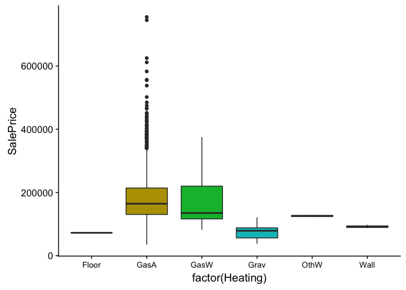
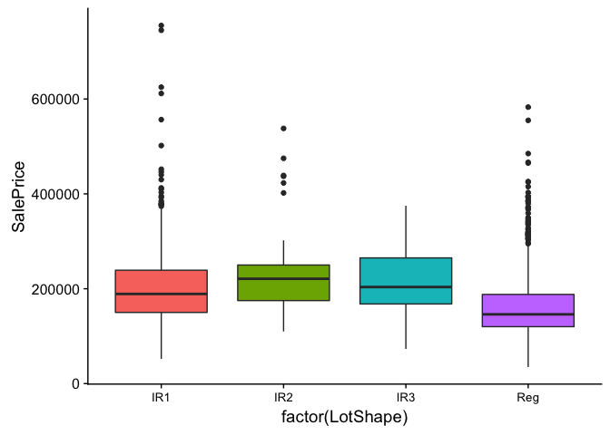

### Introduction

---

Predicting real estate prices is immensely important to the overall health of the US economy.  It is estimated that 16 trillion in total value is represented by residential properties values, a stunning number when compared to the estimated 18 trillion value of the US stock market.  The valuation of the real estate market is characterized by extreme heterogeneity due to the property location and its physical attributes.  In fact, the theoretical price of a piece of real estate can be described as a linear combination of attributes common to all pieces of real estate.  At Thomas, Lingle, and Merritt, we look to optimize this linear relationship with advanced regression techniques to provide the most up to date estimate of your property value.  In the pages that follow, we’ll provide a sampling of our methods on the Ames, IA housing data to demonstrate that our statistical modeling is far superior to the competition. 
[Forcasting Real Estate Prices](https://rady.ucsd.edu/faculty/directory/valkanov/pub/docs/HandRE_GPTV.pdf)
 
Data Description: 
The Ames, IA housing dataset originated from the Ames Assessor’s Office and is used in computing assessed values for individual residential properties sold in Ames, IA from 2006 to 2010.  It was compiled Dean De Cock for use in data science education and it contains 2930 observations, 82 variables (23 nominal, 23 ordinal, 14 discrete, and 20 continuous variables, and 2 additional observation identifiers).  A more thorough discussion can be found in the codebook in this repository.


### Required Libraries

---


```r
library(readr)
library(tibble)
library(dplyr)
library(ggplot2)
library(GGally)
library(purrr)
library(scales)
library(investr)
library(broom)
library(infer)
library(mlr)
library(fastDummies)
library(car)
library(ggcorrplot)
library(MASS)
library(caret)
library(leaps)
library(cowplot)
options(scipen = 999)
```

## Import and Clean Training Dataset

---


```r
#Read in the training data set and view
setwd("~/SMUProjects/AmesIowaHousingPredictions/")
train <- as_tibble(read_csv("Data/train.csv"))
colnames(train)[colnames(train)=="3SsnPorch"] <- "SsnPorch"
```

### NA Review

```r
glimpse(train)
```

```
## Observations: 1,460
## Variables: 81
## $ Id            <int> 1, 2, 3, 4, 5, 6, 7, 8, 9, 10, 11, 12, 13, 14, 1...
## $ MSSubClass    <int> 60, 20, 60, 70, 60, 50, 20, 60, 50, 190, 20, 60,...
## $ MSZoning      <chr> "RL", "RL", "RL", "RL", "RL", "RL", "RL", "RL", ...
## $ LotFrontage   <int> 65, 80, 68, 60, 84, 85, 75, NA, 51, 50, 70, 85, ...
## $ LotArea       <int> 8450, 9600, 11250, 9550, 14260, 14115, 10084, 10...
## $ Street        <chr> "Pave", "Pave", "Pave", "Pave", "Pave", "Pave", ...
## $ Alley         <chr> NA, NA, NA, NA, NA, NA, NA, NA, NA, NA, NA, NA, ...
## $ LotShape      <chr> "Reg", "Reg", "IR1", "IR1", "IR1", "IR1", "Reg",...
## $ LandContour   <chr> "Lvl", "Lvl", "Lvl", "Lvl", "Lvl", "Lvl", "Lvl",...
## $ Utilities     <chr> "AllPub", "AllPub", "AllPub", "AllPub", "AllPub"...
## $ LotConfig     <chr> "Inside", "FR2", "Inside", "Corner", "FR2", "Ins...
## $ LandSlope     <chr> "Gtl", "Gtl", "Gtl", "Gtl", "Gtl", "Gtl", "Gtl",...
## $ Neighborhood  <chr> "CollgCr", "Veenker", "CollgCr", "Crawfor", "NoR...
## $ Condition1    <chr> "Norm", "Feedr", "Norm", "Norm", "Norm", "Norm",...
## $ Condition2    <chr> "Norm", "Norm", "Norm", "Norm", "Norm", "Norm", ...
## $ BldgType      <chr> "1Fam", "1Fam", "1Fam", "1Fam", "1Fam", "1Fam", ...
## $ HouseStyle    <chr> "2Story", "1Story", "2Story", "2Story", "2Story"...
## $ OverallQual   <int> 7, 6, 7, 7, 8, 5, 8, 7, 7, 5, 5, 9, 5, 7, 6, 7, ...
## $ OverallCond   <int> 5, 8, 5, 5, 5, 5, 5, 6, 5, 6, 5, 5, 6, 5, 5, 8, ...
## $ YearBuilt     <int> 2003, 1976, 2001, 1915, 2000, 1993, 2004, 1973, ...
## $ YearRemodAdd  <int> 2003, 1976, 2002, 1970, 2000, 1995, 2005, 1973, ...
## $ RoofStyle     <chr> "Gable", "Gable", "Gable", "Gable", "Gable", "Ga...
## $ RoofMatl      <chr> "CompShg", "CompShg", "CompShg", "CompShg", "Com...
## $ Exterior1st   <chr> "VinylSd", "MetalSd", "VinylSd", "Wd Sdng", "Vin...
## $ Exterior2nd   <chr> "VinylSd", "MetalSd", "VinylSd", "Wd Shng", "Vin...
## $ MasVnrType    <chr> "BrkFace", "None", "BrkFace", "None", "BrkFace",...
## $ MasVnrArea    <int> 196, 0, 162, 0, 350, 0, 186, 240, 0, 0, 0, 286, ...
## $ ExterQual     <chr> "Gd", "TA", "Gd", "TA", "Gd", "TA", "Gd", "TA", ...
## $ ExterCond     <chr> "TA", "TA", "TA", "TA", "TA", "TA", "TA", "TA", ...
## $ Foundation    <chr> "PConc", "CBlock", "PConc", "BrkTil", "PConc", "...
## $ BsmtQual      <chr> "Gd", "Gd", "Gd", "TA", "Gd", "Gd", "Ex", "Gd", ...
## $ BsmtCond      <chr> "TA", "TA", "TA", "Gd", "TA", "TA", "TA", "TA", ...
## $ BsmtExposure  <chr> "No", "Gd", "Mn", "No", "Av", "No", "Av", "Mn", ...
## $ BsmtFinType1  <chr> "GLQ", "ALQ", "GLQ", "ALQ", "GLQ", "GLQ", "GLQ",...
## $ BsmtFinSF1    <int> 706, 978, 486, 216, 655, 732, 1369, 859, 0, 851,...
## $ BsmtFinType2  <chr> "Unf", "Unf", "Unf", "Unf", "Unf", "Unf", "Unf",...
## $ BsmtFinSF2    <int> 0, 0, 0, 0, 0, 0, 0, 32, 0, 0, 0, 0, 0, 0, 0, 0,...
## $ BsmtUnfSF     <int> 150, 284, 434, 540, 490, 64, 317, 216, 952, 140,...
## $ TotalBsmtSF   <int> 856, 1262, 920, 756, 1145, 796, 1686, 1107, 952,...
## $ Heating       <chr> "GasA", "GasA", "GasA", "GasA", "GasA", "GasA", ...
## $ HeatingQC     <chr> "Ex", "Ex", "Ex", "Gd", "Ex", "Ex", "Ex", "Ex", ...
## $ CentralAir    <chr> "Y", "Y", "Y", "Y", "Y", "Y", "Y", "Y", "Y", "Y"...
## $ Electrical    <chr> "SBrkr", "SBrkr", "SBrkr", "SBrkr", "SBrkr", "SB...
## $ FirstFlrSF    <int> 856, 1262, 920, 961, 1145, 796, 1694, 1107, 1022...
## $ SecondFlrSF   <int> 854, 0, 866, 756, 1053, 566, 0, 983, 752, 0, 0, ...
## $ LowQualFinSF  <int> 0, 0, 0, 0, 0, 0, 0, 0, 0, 0, 0, 0, 0, 0, 0, 0, ...
## $ GrLivArea     <int> 1710, 1262, 1786, 1717, 2198, 1362, 1694, 2090, ...
## $ BsmtFullBath  <int> 1, 0, 1, 1, 1, 1, 1, 1, 0, 1, 1, 1, 1, 0, 1, 0, ...
## $ BsmtHalfBath  <int> 0, 1, 0, 0, 0, 0, 0, 0, 0, 0, 0, 0, 0, 0, 0, 0, ...
## $ FullBath      <int> 2, 2, 2, 1, 2, 1, 2, 2, 2, 1, 1, 3, 1, 2, 1, 1, ...
## $ HalfBath      <int> 1, 0, 1, 0, 1, 1, 0, 1, 0, 0, 0, 0, 0, 0, 1, 0, ...
## $ BedroomAbvGr  <int> 3, 3, 3, 3, 4, 1, 3, 3, 2, 2, 3, 4, 2, 3, 2, 2, ...
## $ KitchenAbvGr  <int> 1, 1, 1, 1, 1, 1, 1, 1, 2, 2, 1, 1, 1, 1, 1, 1, ...
## $ KitchenQual   <chr> "Gd", "TA", "Gd", "Gd", "Gd", "TA", "Gd", "TA", ...
## $ TotRmsAbvGrd  <int> 8, 6, 6, 7, 9, 5, 7, 7, 8, 5, 5, 11, 4, 7, 5, 5,...
## $ Functional    <chr> "Typ", "Typ", "Typ", "Typ", "Typ", "Typ", "Typ",...
## $ Fireplaces    <int> 0, 1, 1, 1, 1, 0, 1, 2, 2, 2, 0, 2, 0, 1, 1, 0, ...
## $ FireplaceQu   <chr> NA, "TA", "TA", "Gd", "TA", NA, "Gd", "TA", "TA"...
## $ GarageType    <chr> "Attchd", "Attchd", "Attchd", "Detchd", "Attchd"...
## $ GarageYrBlt   <int> 2003, 1976, 2001, 1998, 2000, 1993, 2004, 1973, ...
## $ GarageFinish  <chr> "RFn", "RFn", "RFn", "Unf", "RFn", "Unf", "RFn",...
## $ GarageCars    <int> 2, 2, 2, 3, 3, 2, 2, 2, 2, 1, 1, 3, 1, 3, 1, 2, ...
## $ GarageArea    <int> 548, 460, 608, 642, 836, 480, 636, 484, 468, 205...
## $ GarageQual    <chr> "TA", "TA", "TA", "TA", "TA", "TA", "TA", "TA", ...
## $ GarageCond    <chr> "TA", "TA", "TA", "TA", "TA", "TA", "TA", "TA", ...
## $ PavedDrive    <chr> "Y", "Y", "Y", "Y", "Y", "Y", "Y", "Y", "Y", "Y"...
## $ WoodDeckSF    <int> 0, 298, 0, 0, 192, 40, 255, 235, 90, 0, 0, 147, ...
## $ OpenPorchSF   <int> 61, 0, 42, 35, 84, 30, 57, 204, 0, 4, 0, 21, 0, ...
## $ EnclosedPorch <int> 0, 0, 0, 272, 0, 0, 0, 228, 205, 0, 0, 0, 0, 0, ...
## $ SsnPorch      <int> 0, 0, 0, 0, 0, 320, 0, 0, 0, 0, 0, 0, 0, 0, 0, 0...
## $ ScreenPorch   <int> 0, 0, 0, 0, 0, 0, 0, 0, 0, 0, 0, 0, 176, 0, 0, 0...
## $ PoolArea      <int> 0, 0, 0, 0, 0, 0, 0, 0, 0, 0, 0, 0, 0, 0, 0, 0, ...
## $ PoolQC        <chr> NA, NA, NA, NA, NA, NA, NA, NA, NA, NA, NA, NA, ...
## $ Fence         <chr> NA, NA, NA, NA, NA, "MnPrv", NA, NA, NA, NA, NA,...
## $ MiscFeature   <chr> NA, NA, NA, NA, NA, "Shed", NA, "Shed", NA, NA, ...
## $ MiscVal       <int> 0, 0, 0, 0, 0, 700, 0, 350, 0, 0, 0, 0, 0, 0, 0,...
## $ MoSold        <int> 2, 5, 9, 2, 12, 10, 8, 11, 4, 1, 2, 7, 9, 8, 5, ...
## $ YrSold        <int> 2008, 2007, 2008, 2006, 2008, 2009, 2007, 2009, ...
## $ SaleType      <chr> "WD", "WD", "WD", "WD", "WD", "WD", "WD", "WD", ...
## $ SaleCondition <chr> "Normal", "Normal", "Normal", "Abnorml", "Normal...
## $ SalePrice     <int> 208500, 181500, 223500, 140000, 250000, 143000, ...
```

```r
#Determine the NAs and missing data in the dataset and list in descending order
na.feature = which(colSums(is.na(train)) > 0)
sort(colSums(sapply(train[na.feature], is.na)), decreasing = TRUE)
```

```
##       PoolQC  MiscFeature        Alley        Fence  FireplaceQu 
##         1453         1406         1369         1179          690 
##  LotFrontage   GarageType  GarageYrBlt GarageFinish   GarageQual 
##          259           81           81           81           81 
##   GarageCond     BsmtQual     BsmtCond BsmtExposure BsmtFinType1 
##           81           37           37           37           37 
## BsmtFinType2   MasVnrType   MasVnrArea   Electrical 
##           37            8            8            1
```

Previous analysis in SAS provided insights into the variables with large numbers of NAs.  NA for `Alley`, `Fence`, `MiscFeature`, `PooQC`, and `FireplaceQu` will be changed to **No Alley**, **No Fence**, etc....


```r
index <- which(is.na(train$Alley))
train[index, 'Alley'] <- 'No Alley'

index <- which(is.na(train$Fence))
train[index, 'Fence'] <- 'No Fence'

index <- which(is.na(train$MiscFeature))
train[index, 'MiscFeature'] <- 'No Feature'

index <- which(is.na(train$PoolQC))
train[index, 'PoolQC'] <- 'No Pool'

index <- which(is.na(train$FireplaceQu))
train[index, 'FireplaceQu'] <- 'No Fireplace'
```

#### Garage Variable NAs
We first want to verify that no Garages that have a specified type have a `GarageArea` or `GarageCars` less than zero, along with verifying there are no significant outliers in `GarageYrBlt`.  Garage variables account for 81 NAs in the *Train* dataset.  

```r
train[(is.na(train$GarageType) & train$GarageArea >0) | (is.na(train$GarageType) & train$GarageCars > 0), ]
```

```
## # A tibble: 0 x 81
## # ... with 81 variables: Id <int>, MSSubClass <int>, MSZoning <chr>,
## #   LotFrontage <int>, LotArea <int>, Street <chr>, Alley <chr>,
## #   LotShape <chr>, LandContour <chr>, Utilities <chr>, LotConfig <chr>,
## #   LandSlope <chr>, Neighborhood <chr>, Condition1 <chr>,
## #   Condition2 <chr>, BldgType <chr>, HouseStyle <chr>, OverallQual <int>,
## #   OverallCond <int>, YearBuilt <int>, YearRemodAdd <int>,
## #   RoofStyle <chr>, RoofMatl <chr>, Exterior1st <chr>, Exterior2nd <chr>,
## #   MasVnrType <chr>, MasVnrArea <int>, ExterQual <chr>, ExterCond <chr>,
## #   Foundation <chr>, BsmtQual <chr>, BsmtCond <chr>, BsmtExposure <chr>,
## #   BsmtFinType1 <chr>, BsmtFinSF1 <int>, BsmtFinType2 <chr>,
## #   BsmtFinSF2 <int>, BsmtUnfSF <int>, TotalBsmtSF <int>, Heating <chr>,
## #   HeatingQC <chr>, CentralAir <chr>, Electrical <chr>, FirstFlrSF <int>,
## #   SecondFlrSF <int>, LowQualFinSF <int>, GrLivArea <int>,
## #   BsmtFullBath <int>, BsmtHalfBath <int>, FullBath <int>,
## #   HalfBath <int>, BedroomAbvGr <int>, KitchenAbvGr <int>,
## #   KitchenQual <chr>, TotRmsAbvGrd <int>, Functional <chr>,
## #   Fireplaces <int>, FireplaceQu <chr>, GarageType <chr>,
## #   GarageYrBlt <int>, GarageFinish <chr>, GarageCars <int>,
## #   GarageArea <int>, GarageQual <chr>, GarageCond <chr>,
## #   PavedDrive <chr>, WoodDeckSF <int>, OpenPorchSF <int>,
## #   EnclosedPorch <int>, SsnPorch <int>, ScreenPorch <int>,
## #   PoolArea <int>, PoolQC <chr>, Fence <chr>, MiscFeature <chr>,
## #   MiscVal <int>, MoSold <int>, YrSold <int>, SaleType <chr>,
## #   SaleCondition <chr>, SalePrice <int>
```

```r
summary(train$GarageYrBlt)
```

```
##    Min. 1st Qu.  Median    Mean 3rd Qu.    Max.    NA's 
##    1900    1961    1980    1979    2002    2010      81
```

```r
train %>%
    filter(is.na(GarageCond) & !is.na(GarageType))
```

```
## # A tibble: 0 x 81
## # ... with 81 variables: Id <int>, MSSubClass <int>, MSZoning <chr>,
## #   LotFrontage <int>, LotArea <int>, Street <chr>, Alley <chr>,
## #   LotShape <chr>, LandContour <chr>, Utilities <chr>, LotConfig <chr>,
## #   LandSlope <chr>, Neighborhood <chr>, Condition1 <chr>,
## #   Condition2 <chr>, BldgType <chr>, HouseStyle <chr>, OverallQual <int>,
## #   OverallCond <int>, YearBuilt <int>, YearRemodAdd <int>,
## #   RoofStyle <chr>, RoofMatl <chr>, Exterior1st <chr>, Exterior2nd <chr>,
## #   MasVnrType <chr>, MasVnrArea <int>, ExterQual <chr>, ExterCond <chr>,
## #   Foundation <chr>, BsmtQual <chr>, BsmtCond <chr>, BsmtExposure <chr>,
## #   BsmtFinType1 <chr>, BsmtFinSF1 <int>, BsmtFinType2 <chr>,
## #   BsmtFinSF2 <int>, BsmtUnfSF <int>, TotalBsmtSF <int>, Heating <chr>,
## #   HeatingQC <chr>, CentralAir <chr>, Electrical <chr>, FirstFlrSF <int>,
## #   SecondFlrSF <int>, LowQualFinSF <int>, GrLivArea <int>,
## #   BsmtFullBath <int>, BsmtHalfBath <int>, FullBath <int>,
## #   HalfBath <int>, BedroomAbvGr <int>, KitchenAbvGr <int>,
## #   KitchenQual <chr>, TotRmsAbvGrd <int>, Functional <chr>,
## #   Fireplaces <int>, FireplaceQu <chr>, GarageType <chr>,
## #   GarageYrBlt <int>, GarageFinish <chr>, GarageCars <int>,
## #   GarageArea <int>, GarageQual <chr>, GarageCond <chr>,
## #   PavedDrive <chr>, WoodDeckSF <int>, OpenPorchSF <int>,
## #   EnclosedPorch <int>, SsnPorch <int>, ScreenPorch <int>,
## #   PoolArea <int>, PoolQC <chr>, Fence <chr>, MiscFeature <chr>,
## #   MiscVal <int>, MoSold <int>, YrSold <int>, SaleType <chr>,
## #   SaleCondition <chr>, SalePrice <int>
```
There are no garages newer than 2010, so we can assume all values for `GarageYrBlt`.  We have also confirmed all other garage-related NAs are valid, so we will replace NA with **No Garage** for both the categorical and continuous garage variables.   


```r
garagecatvariables <- c('GarageType', 'GarageFinish', 'GarageQual', 'GarageCond')
for (i in seq_along(garagecatvariables)){
    index <- which(is.na(train[garagecatvariables[i]]))
    train[index, garagecatvariables[i]] <- 'No Garage'
    #summary(as.factor(train$garagevariables[i])) receiving error with this line of code will investigate
}

garagecontvariables <- c('GarageYrBlt', 'GarageArea', 'GarageCars')

for (i in seq_along(garagecontvariables)){
    index <- which(is.na(train[garagecontvariables[i]]))
    train[index, garagecontvariables[i]] <- 0
    #summary(as.factor(train$garagevariables[i])) receiving error with this line of code will investigate
}

summary(as.factor(train$GarageQual))
```

```
##        Ex        Fa        Gd No Garage        Po        TA 
##         3        48        14        81         3      1311
```

```r
summary(as.factor(train$GarageCond))
```

```
##        Ex        Fa        Gd No Garage        Po        TA 
##         2        35         9        81         7      1326
```

```r
summary(as.factor(train$GarageType))
```

```
##    2Types    Attchd   Basment   BuiltIn   CarPort    Detchd No Garage 
##         6       870        19        88         9       387        81
```

```r
summary(as.factor(train$GarageFinish))
```

```
##       Fin No Garage       RFn       Unf 
##       352        81       422       605
```

```r
summary(train$GarageYrBlt)
```

```
##    Min. 1st Qu.  Median    Mean 3rd Qu.    Max. 
##       0    1958    1977    1869    2001    2010
```

```r
summary(train$GarageArea)
```

```
##    Min. 1st Qu.  Median    Mean 3rd Qu.    Max. 
##     0.0   334.5   480.0   473.0   576.0  1418.0
```

```r
summary(train$GarageCars)
```

```
##    Min. 1st Qu.  Median    Mean 3rd Qu.    Max. 
##   0.000   1.000   2.000   1.767   2.000   4.000
```


#### Basement Variable NAs
Taking a similar approach, we will verify whether any listing with non-NA values for `BsmtFinType1` or `BsmtCond` have `BsmtFinSF1` or `BsmtFinSF2` greater than zero.  

```r
bsmtvariables <- c('BsmtQual', 'BsmtCond', 'BsmtExposure', 'BsmtFinType1', 'BsmtFinType2')
train[(is.na(train$BsmtFinType1) & train$BsmtFinSF1 >0) | (is.na(train$BsmtFinType2) & train$BsmtFinSF2 > 0), ]
```

```
## # A tibble: 0 x 81
## # ... with 81 variables: Id <int>, MSSubClass <int>, MSZoning <chr>,
## #   LotFrontage <int>, LotArea <int>, Street <chr>, Alley <chr>,
## #   LotShape <chr>, LandContour <chr>, Utilities <chr>, LotConfig <chr>,
## #   LandSlope <chr>, Neighborhood <chr>, Condition1 <chr>,
## #   Condition2 <chr>, BldgType <chr>, HouseStyle <chr>, OverallQual <int>,
## #   OverallCond <int>, YearBuilt <int>, YearRemodAdd <int>,
## #   RoofStyle <chr>, RoofMatl <chr>, Exterior1st <chr>, Exterior2nd <chr>,
## #   MasVnrType <chr>, MasVnrArea <int>, ExterQual <chr>, ExterCond <chr>,
## #   Foundation <chr>, BsmtQual <chr>, BsmtCond <chr>, BsmtExposure <chr>,
## #   BsmtFinType1 <chr>, BsmtFinSF1 <int>, BsmtFinType2 <chr>,
## #   BsmtFinSF2 <int>, BsmtUnfSF <int>, TotalBsmtSF <int>, Heating <chr>,
## #   HeatingQC <chr>, CentralAir <chr>, Electrical <chr>, FirstFlrSF <int>,
## #   SecondFlrSF <int>, LowQualFinSF <int>, GrLivArea <int>,
## #   BsmtFullBath <int>, BsmtHalfBath <int>, FullBath <int>,
## #   HalfBath <int>, BedroomAbvGr <int>, KitchenAbvGr <int>,
## #   KitchenQual <chr>, TotRmsAbvGrd <int>, Functional <chr>,
## #   Fireplaces <int>, FireplaceQu <chr>, GarageType <chr>,
## #   GarageYrBlt <dbl>, GarageFinish <chr>, GarageCars <dbl>,
## #   GarageArea <dbl>, GarageQual <chr>, GarageCond <chr>,
## #   PavedDrive <chr>, WoodDeckSF <int>, OpenPorchSF <int>,
## #   EnclosedPorch <int>, SsnPorch <int>, ScreenPorch <int>,
## #   PoolArea <int>, PoolQC <chr>, Fence <chr>, MiscFeature <chr>,
## #   MiscVal <int>, MoSold <int>, YrSold <int>, SaleType <chr>,
## #   SaleCondition <chr>, SalePrice <int>
```

```r
train[(is.na(train$BsmtExposure) & train$BsmtFinSF1 >0) | (is.na(train$BsmtCond) & train$BsmtFinSF1 > 0), ]
```

```
## # A tibble: 0 x 81
## # ... with 81 variables: Id <int>, MSSubClass <int>, MSZoning <chr>,
## #   LotFrontage <int>, LotArea <int>, Street <chr>, Alley <chr>,
## #   LotShape <chr>, LandContour <chr>, Utilities <chr>, LotConfig <chr>,
## #   LandSlope <chr>, Neighborhood <chr>, Condition1 <chr>,
## #   Condition2 <chr>, BldgType <chr>, HouseStyle <chr>, OverallQual <int>,
## #   OverallCond <int>, YearBuilt <int>, YearRemodAdd <int>,
## #   RoofStyle <chr>, RoofMatl <chr>, Exterior1st <chr>, Exterior2nd <chr>,
## #   MasVnrType <chr>, MasVnrArea <int>, ExterQual <chr>, ExterCond <chr>,
## #   Foundation <chr>, BsmtQual <chr>, BsmtCond <chr>, BsmtExposure <chr>,
## #   BsmtFinType1 <chr>, BsmtFinSF1 <int>, BsmtFinType2 <chr>,
## #   BsmtFinSF2 <int>, BsmtUnfSF <int>, TotalBsmtSF <int>, Heating <chr>,
## #   HeatingQC <chr>, CentralAir <chr>, Electrical <chr>, FirstFlrSF <int>,
## #   SecondFlrSF <int>, LowQualFinSF <int>, GrLivArea <int>,
## #   BsmtFullBath <int>, BsmtHalfBath <int>, FullBath <int>,
## #   HalfBath <int>, BedroomAbvGr <int>, KitchenAbvGr <int>,
## #   KitchenQual <chr>, TotRmsAbvGrd <int>, Functional <chr>,
## #   Fireplaces <int>, FireplaceQu <chr>, GarageType <chr>,
## #   GarageYrBlt <dbl>, GarageFinish <chr>, GarageCars <dbl>,
## #   GarageArea <dbl>, GarageQual <chr>, GarageCond <chr>,
## #   PavedDrive <chr>, WoodDeckSF <int>, OpenPorchSF <int>,
## #   EnclosedPorch <int>, SsnPorch <int>, ScreenPorch <int>,
## #   PoolArea <int>, PoolQC <chr>, Fence <chr>, MiscFeature <chr>,
## #   MiscVal <int>, MoSold <int>, YrSold <int>, SaleType <chr>,
## #   SaleCondition <chr>, SalePrice <int>
```
It is now safe to assume that all basement NA values are valid, so we will replace all basement NA values with **No Basement**.


```r
for (i in seq_along(bsmtvariables)){
    index <- which(is.na(train[bsmtvariables[i]]))
    train[index, bsmtvariables[i]] <- 'No Basement'
    #summary(as.factor(train$garagevariables[i])) receiving error with this line of code will investigate
}

summary(as.factor(train$BsmtQual))
```

```
##          Ex          Fa          Gd No Basement          TA 
##         121          35         618          37         649
```

```r
summary(as.factor(train$BsmtCond))
```

```
##          Fa          Gd No Basement          Po          TA 
##          45          65          37           2        1311
```

```r
summary(as.factor(train$BsmtExposure))
```

```
##          Av          Gd          Mn          No No Basement 
##         221         134         114         954          37
```

```r
summary(as.factor(train$BsmtFinType1))
```

```
##         ALQ         BLQ         GLQ         LwQ No Basement         Rec 
##         220         148         418          74          37         133 
##         Unf 
##         430
```

```r
summary(as.factor(train$BsmtFinType2))
```

```
##         ALQ         BLQ         GLQ         LwQ No Basement         Rec 
##          19          33          14          46          37          54 
##         Unf 
##        1257
```

####  Lot Frontage NAs
The next variable we'll investigate is `LotFrontage`.  There are xxxxx NA observations for Lot Frontage, however, this is not a simple replacment.  Each `Neighborhood` has different median values for Lot Frontage, so we will look to impute the median `LotFrontage` by `Neighborhood` to fill in the remaining values.

```r
#Impute LotFrontage by Median per each neighborhood
index <- which(is.na(train$LotFrontage))
table(train[index, 'Neighborhood'])
```

```
## 
## Blmngtn BrkSide ClearCr CollgCr Crawfor Edwards Gilbert  IDOTRR MeadowV 
##       3       7      15      24      10       8      30       3       2 
## Mitchel   NAmes NoRidge NPkVill NridgHt  NWAmes OldTown  Sawyer SawyerW 
##      13      39       8       2       1      28       4      26       9 
## Somerst StoneBr   SWISU  Timber Veenker 
##       8       5       2       8       4
```

```r
frontage_by_neighborhood <- train %>%
    dplyr::select(Neighborhood, LotFrontage) %>%
    group_by(Neighborhood) %>%
    summarise(median_frontage = median(LotFrontage, na.rm = TRUE))

for (i in index) {
    med_frontage = frontage_by_neighborhood[frontage_by_neighborhood == train$Neighborhood[i], 'median_frontage']
    # then replace the missing value with the median
    train[i, 'LotFrontage'] = med_frontage[[1]]
}
```

#### MasVnrArea, MasVnrType, and Electrical Types NAs
For `MasVnrArea` and `MasVnrType` we first want to see if there are observations with a `MasVnrType` of **None** and `MasVnrArea` greater than 0, and there five homes that qualify.  Since we don't know if the areas are valid and no type is specified, we will set those five observation to 0 for `MasVnrArea`.  We'll then look to see if there are any observations with 0 `MasVnrArea`, but with a `MasVnrType` specified.  There are two such observations, so we will set the `MasVnrType` to **None** for those observations.  Finally we'll clean up any remaing NAs by replacing them with **None** or 0 for `MasVnrType` and `MasVnrArea` respectively.

```r
index <- which(train$MasVnrType == 'None' & train$MasVnrArea != 0)
train[index,'MasVnrArea']
```

```
## # A tibble: 5 x 1
##   MasVnrArea
##        <int>
## 1        288
## 2          1
## 3          1
## 4        344
## 5        312
```

```r
train[index, 'MasVnrArea'] <- 0
index <- which(train$MasVnrType != 'None' & train$MasVnrArea == 0)
train[index,'MasVnrType']
```

```
## # A tibble: 2 x 1
##   MasVnrType
##   <chr>     
## 1 BrkFace   
## 2 Stone
```

```r
train[index, 'MasVnrType'] <- 'None'
index <- which(is.na(train$MasVnrType) & is.na(train$MasVnrArea))
train[index, 'MasVnrType'] <- 'None'
train[index, 'MasVnrArea'] <- 0

#Electrical types, median sale price for NA home is very near SBrkr median sale prices.
index <- which(is.na(train$Electrical))
train[index,'Electrical'] <- 'SBrkr'
```

### Categorical Data Cleaning and EDA
First we'll create a function to create bar charts for selected categorical variables that are modiified following analysis.  Our goal in the analysis is to look for similarirties between the attributes of the categorical variables and combine then when appropriate based on Median `SalePrice`.

```r
catvariables <- c('MSZoning', 'Street', 'Alley', 'LotShape', 'LandContour', 'Utilities', 'LotConfig', 'LandSlope',
                  'Condition1','Condition2', 'BldgType', 'HouseStyle', 'RoofStyle', 'RoofMatl', 'Exterior1st', 'Exterior2nd',
                  'MasVnrType', 'ExterQual', 'ExterCond', 'Foundation', 'BsmtQual', 'BsmtCond', 'BsmtExposure', 'BsmtFinType1',
                  'BsmtFinType2', 'Heating', 'HeatingQC', 'CentralAir', 'Electrical', 'KitchenQual', 'Functional', 'FireplaceQu',
                  'GarageType', 'GarageFinish', 'GarageQual', 'GarageCond', 'PavedDrive', 'Fence', 'PoolQC', 'MiscFeature',
                  'SaleType', 'SaleCondition')

# Function to create bar chart for Categorical variables
plotCategorical = function(cols, dataframe) {
    for (col in cols) {
        # Remove NA's & sort categories by tally
        order.cols = names(sort(table(dataframe[,col]), decreasing = TRUE))
        # qplot is ggplot's equivalent of base R's high-level plotting function `plot`
        num.plot = ggplot(dataframe, aes(dataframe[,col])) +
            # change bar color 
            geom_bar(fill = 'cornflowerblue') +
            # add the value labels to each bar
            geom_text(aes(label = ..count..), stat='count', vjust=-0.5) +
            # minimal theme
            theme_minimal() +
            # set scales for each plot to go from 0 to max of categorical feature
            scale_y_continuous(limits = c(0,max(table(dataframe[,col]))*1.1)) +
            scale_x_discrete(limits = order.cols) +
            xlab(col) +
            # rotate x-axis label text 30 degrees and set font size to 12
            theme(axis.text.x = element_text(angle = 30, size=12))
        # Show plot and suppress warning messages from plot function
        suppressWarnings(print(num.plot))
    }
}
```

#### SaleType

```r
ggplot(train, aes(x = factor(SaleType), y = SalePrice)) + 
    geom_boxplot(aes(fill = factor(SaleType))) + 
    theme(axis.text.x = element_text(angle = 0, size = 10), legend.position = "none") 
```

<!-- -->

```r
#Combine all Low Downpayment and Low Interest contracts into one category
index <- which(train$SaleType == 'ConLD' | train$SaleType == 'ConLI' | train$SaleType == 'ConLw')
train[index, 'SaleType'] <- 'ConLdLi'
```
As we can see above, the Median `SalePrice` for the Conditional Sales attributes are nearly equal, so theses will be combined into a single category **ConLdLi**.

#### Heating

```r
ggplot(train, aes(x = factor(Heating), y = SalePrice)) + 
    geom_boxplot(aes(fill = factor(Heating))) + 
    theme(axis.text.x = element_text(angle = 0, size = 10), legend.position = "none") 
```

<!-- -->

```r
#Combine Furnace type Heating into one Category
index <- which(train$Heating == 'Floor' | train$Heating == 'OthW' | train$Heating == 'Wall' | train$Heating == 'Grav')
train[index, 'Heating'] <- 'Furnace'
```
We can see above that the the four different furnace `Heating` types have similar Median `SalePrice` values, so we will combine them into one category, **Furnace**.

#### Functional

```r
ggplot(train, aes(x = factor(Functional), y = SalePrice)) + 
    geom_boxplot(aes(fill = factor(Functional))) + 
    theme(axis.text.x = element_text(angle = 0, size = 10), legend.position = "none") 
```

<!-- -->

```r
#Combine Furnace type Heating into one Category
index <- which(train$Functional == 'Min1' | train$Functional == 'Min2')
train[index, 'Functional'] <- 'Minor'
```
As you can see above, Min1 and Min2 have similar Median `SalePrice` value and will combined into one, more descriptive category, **Minor**.

#### Condition 1 and Condition 2 

```r
ggplot(train, aes(x = factor(Condition1), y = SalePrice)) + 
    geom_boxplot(aes(fill = factor(Condition1))) + 
    theme(axis.text.x = element_text(angle = 0, size = 10), legend.position = "none") 
```

<!-- -->

```r
#Review proximity to various conditions
index <- which(train$Condition1 == 'PosA' | train$Condition1 == 'PosN')
train[index, 'Condition1'] <- 'NearPos'

index <- which(train$Condition2 == 'PosA' | train$Condition2 == 'PosN')
train[index, 'Condition2'] <- 'NearPos'

index <- which(train$Condition1 == 'RRAe' | train$Condition1 == 'RRAn' | train$Condition1 == 'RRNe' | train$Condition1 == 'RRNn')
train[index, 'Condition1'] <- 'NearTrain'

index <- which(train$Condition2 == 'RRAe' | train$Condition2 == 'RRAn' | train$Condition2 == 'RRNe' | train$Condition2 == 'RRNn')
train[index, 'Condition2'] <- 'NearTrain'
```
There is very little difference in Median `SalePrice` based on direction of proximity to a Railway or Positive feature.  We will combine all of these into 2 categories, **NearPos** or **NearTrain**.


#### LotShape and MSZoning Variable 

```r
ggplot(train, aes(x = factor(LotShape), y = SalePrice)) + 
    geom_boxplot(aes(fill = factor(LotShape))) + 
    theme(axis.text.x = element_text(angle = 0, size = 10), legend.position = "none") 
```

<!-- -->

```r
#Combine IR2 and IR3
index <- which(train$LotShape == 'IR2' | train$LotShape == 'IR3')
train[index, 'LotShape'] <- 'IR2 + 3'

# MSZoning Shorten to C (all) to C
index <- which(train$MSZoning == "C (all)")
train[index, 'MSZoning'] <- "C"
```
Irregular Lots Shapes 2 and 3 have similar Medial `SalePrice` values and will be combined into one category **IR2 + 3**, and we'll change `MSZoning` category **C (all)** to **C**.

We'll now loop through all of the modified categorical variables to review their individual loadings and the Median `SalePrice` value for each category.

```r
#Variables combined during cleaning 
modcats <- c('SaleType', 'MSZoning', 'Functional', 'Condition1', 'Condition2', 'LotShape', 'Heating')

#Loop to print all bar charts for the categorical variables along with a summary of median price
for (i in seq_along(modcats)){
    plotCategorical(modcats[i], train)
    train %>%
        group_by_at(vars(modcats[i])) %>%
        summarize(median_sale_price = median(SalePrice), n = n()) %>% print()
}
```

<!-- -->

```
## # A tibble: 7 x 3
##   SaleType median_sale_price     n
##   <chr>                <dbl> <int>
## 1 COD                 139000    43
## 2 Con                 269600     2
## 3 ConLdLi             140000    19
## 4 CWD                 188750     4
## 5 New                 247453   122
## 6 Oth                 116050     3
## 7 WD                  158000  1267
```

<!-- -->

```
## # A tibble: 5 x 3
##   MSZoning median_sale_price     n
##   <chr>                <dbl> <int>
## 1 C                    74700    10
## 2 FV                  205950    65
## 3 RH                  136500    16
## 4 RL                  174000  1151
## 5 RM                  120500   218
```

<!-- -->

```
## # A tibble: 6 x 3
##   Functional median_sale_price     n
##   <chr>                  <dbl> <int>
## 1 Maj1                  140750    14
## 2 Maj2                   85000     5
## 3 Minor                 139900    65
## 4 Mod                   137900    15
## 5 Sev                   129000     1
## 6 Typ                   165500  1360
```

<!-- -->

```
## # A tibble: 5 x 3
##   Condition1 median_sale_price     n
##   <chr>                  <dbl> <int>
## 1 Artery                119550    48
## 2 Feedr                 140000    81
## 3 NearPos               200000    27
## 4 NearTrain             160500    44
## 5 Norm                  166500  1260
```

<!-- -->

```
## # A tibble: 5 x 3
##   Condition2 median_sale_price     n
##   <chr>                  <dbl> <int>
## 1 Artery               106500      2
## 2 Feedr                127500      6
## 3 NearPos              325000      3
## 4 NearTrain            130952.     4
## 5 Norm                 163500   1445
```

<!-- -->

```
## # A tibble: 3 x 3
##   LotShape median_sale_price     n
##   <chr>                <dbl> <int>
## 1 IR1                 189000   484
## 2 IR2 + 3             215000    51
## 3 Reg                 146000   925
```

<!-- -->

```
## # A tibble: 3 x 3
##   Heating median_sale_price     n
##   <chr>               <dbl> <int>
## 1 Furnace             88750    14
## 2 GasA               164500  1428
## 3 GasW               134950    18
```

### Cleaning for Ordinal Variables         

#### Homes with 2 kitchens
We'll primarily look at the impact of having two kitchens in a home.  There are 65 observations with 2 kitchens, with 60 of those being Two-Family Condominiums of Duplexes.  Only 5 homes categorized as Single-Family had 2 kitchens, with a Median `SalePrice` of $107,500.  With this in mind, `KitchenAbvGr` in these homes was changed to 1, along with 1 being subtracted from `TotRmsAbvGrd`.

```r
#Determine number and type of homes with 2 kitchens
index <- which(train$KitchenAbvGr == 2)
train[index, ] %>%
    summarize(median_sale_price = median(SalePrice), n = n()) %>% print()
```

```
## # A tibble: 1 x 2
##   median_sale_price     n
##               <int> <int>
## 1            133900    65
```

```r
twokitchens <- train[index, ]
twokitchens %>%
    group_by(BldgType) %>%
    summarize(median_sale_price = median(SalePrice), n = n()) %>% print()
```

```
## # A tibble: 3 x 3
##   BldgType median_sale_price     n
##   <chr>                <dbl> <int>
## 1 1Fam               107500      5
## 2 2fmCon             125000     16
## 3 Duplex             136702.    44
```

```r
index <- which(train$BldgType == '1Fam' & train$KitchenAbvGr == '2')
singlefam2kitchen <- train[index, ]

#Changed all Single-Family home types to have 1 Kitchen Above Ground
index <- which(train$BldgType == '1Fam')
train[index, 'KitchenAbvGr'] <- 1
train[index, 'TotRmsAbvGrd'] <- train[index, 'TotRmsAbvGrd'] - 1
```

## Import and Clean Test Dataset

---

With the exception of the *Garage* and *Basement* variables, the code to clean the test dataset is nearly identical to the code required to clean the training dataset above.  I will only include code snippets and outputs from the analysis on the variables mentione above.  For a more thorough code review of the Test dataset, please see the **TestCleanEDA.R** file in the Code folder of this repository.


#### Garage and Basement Variables

```r
#Determine the NAs and missing data in the dataset
na.feature = which(colSums(is.na(test)) > 0)
sort(colSums(sapply(test[na.feature], is.na)), decreasing = TRUE)
```

```
##  GarageYrBlt GarageFinish   GarageQual   GarageCond   GarageType 
##           78           78           78           78           76 
##     BsmtCond     BsmtQual BsmtExposure BsmtFinType1 BsmtFinType2 
##           45           44           44           42           42 
##   GarageCars   GarageArea 
##            1            1
```
As can be seen above, there is a miscompare in the number of NAs amongst all of the Garage Variables, with the majority having 78 NAs, but `GarageType` has 76 NAs and both `GarageCars` and `GarageArea` each have 1.  We can find the two missing NAs in the `GarageType` by running the code below.  We determine that each of these observations have **Detachd** for `GarageType`, with no other Garage variables filled in.  We will change `GarageType` to **No Garage** for each of these variables.


```r
# Verify no NA GarageTypes have an Area or Car number > 0
GarTypeNA <- test[!is.na(test$GarageType) & is.na(test$GarageQual), ]
print(GarTypeNA$GarageType)
```

```
## [1] "Detchd" "Detchd"
```

```r
index <- which(!is.na(test$GarageType) & is.na(test$GarageCars))
test[index, 'GarageType'] <- 'No Garage'
```


```r
index <- which(!is.na(test$GarageType) & !is.na(test$GarageCars) & is.na(test$GarageQual))
print(test[index, c('Id','GarageQual', 'GarageCond', 'GarageFinish', 'GarageYrBlt', 'GarageType', 'GarageArea', 'GarageCars')])
```

```
## # A tibble: 1 x 8
##      Id GarageQual GarageCond GarageFinish GarageYrBlt GarageType
##   <int> <chr>      <chr>      <chr>              <int> <chr>     
## 1  2127 <NA>       <NA>       <NA>                  NA Detchd    
## # ... with 2 more variables: GarageArea <int>, GarageCars <int>
```
As we can see above, there are values for `GarageType`, `GarageArea`, and `GarageCars`, wo we cannot assume there is no Garage for this observation.  We will impute the values for the remaining Garage variables with the most common responses.

```r
test[index, 'GarageQual'] <- 'TA'
test[index, 'GarageCond'] <- 'TA'
test[index, 'GarageFinish'] <- 'Unf'
test[index, 'GarageYrBlt'] <- test[index, 'YearBuilt']
```
Finally we look for any outliers in the `GarageYrBlt` variable and we find a Garage built in the year, 2207.  The house itself was built in 2007, so we will change `GarageYrBlt` to equal `YearBuilt` for this observation.

```r
# Verifying no outliers in GarageYrBlt  
summary(test$GarageYrBlt)
```

```
##    Min. 1st Qu.  Median    Mean 3rd Qu.    Max.    NA's 
##    1895    1959    1979    1978    2002    2207      77
```

```r
index <- which(test$GarageYrBlt == 2207)
test[index, 'GarageYrBlt'] <- test[index, 'YearBuilt']
```

Finally we will replace the remaining NA values with **No Garage**.  Leaving 77 observations with the new **No Garage** value.

```r
garagecatvariables <- c('GarageType', 'GarageFinish', 'GarageQual', 'GarageCond')
for (i in seq_along(garagecatvariables)){
    index <- which(is.na(test[garagecatvariables[i]]))
    test[index, garagecatvariables[i]] <- 'No Garage'
    #summary(as.factor(train$garagevariables[i])) receiving error with this line of code will investigate
}

summary(as.factor(test$GarageQual))
```

```
##        Fa        Gd No Garage        Po        TA 
##        76        10        77         2      1294
```

```r
summary(as.factor(test$GarageCond))
```

```
##        Ex        Fa        Gd No Garage        Po        TA 
##         1        39         6        77         7      1329
```

```r
summary(as.factor(test$GarageType))
```

```
##    2Types    Attchd   Basment   BuiltIn   CarPort    Detchd No Garage 
##        17       853        17        98         6       391        77
```

```r
summary(as.factor(test$GarageFinish))
```

```
##       Fin No Garage       RFn       Unf 
##       367        77       389       626
```

```r
garagecontvariables <- c('GarageYrBlt', 'GarageArea', 'GarageCars')
for (i in seq_along(garagecontvariables)){
    index <- which(is.na(test[garagecontvariables[i]]))
    test[index, garagecontvariables[i]] <- 0
    #summary(as.factor(train$garagevariables[i])) receiving error with this line of code will investigate
}

summary(test$GarageYrBlt)
```

```
##    Min. 1st Qu.  Median    Mean 3rd Qu.    Max. 
##       0    1956    1977    1873    2001    2010
```

```r
summary(test$GarageArea)
```

```
##    Min. 1st Qu.  Median    Mean 3rd Qu.    Max. 
##     0.0   317.5   480.0   472.4   576.0  1488.0
```

```r
summary(test$GarageCars)
```

```
##    Min. 1st Qu.  Median    Mean 3rd Qu.    Max. 
##   0.000   1.000   2.000   1.765   2.000   5.000
```

As we saw above there is a miscompare between the Basement variables with most having 44 NAs, however, `BsmtCond` had 45 and `BsmtFinType1` and `BsmtFinType2` had 42 NAs.  We'll more closely as the miscompare below.  


```r
bsmtvariables <- c('BsmtQual', 'BsmtCond', 'BsmtExposure', 'BsmtFinType1', 'BsmtFinType2')
index <- which(!is.na(test$BsmtFinType1) & is.na(test$BsmtCond))
print(test[index, c('Id', 'BsmtQual', 'BsmtCond', 'BsmtExposure', 'BsmtFinType1', 'BsmtFinType2')])
```

```
## # A tibble: 3 x 6
##      Id BsmtQual BsmtCond BsmtExposure BsmtFinType1 BsmtFinType2
##   <int> <chr>    <chr>    <chr>        <chr>        <chr>       
## 1  2041 Gd       <NA>     Mn           GLQ          Rec         
## 2  2186 TA       <NA>     No           BLQ          Unf         
## 3  2525 TA       <NA>     Av           ALQ          Unf
```

```r
index <- which(!is.na(test$BsmtCond) & is.na(test$BsmtExposure))
print(test[index, c('Id', 'BsmtQual', 'BsmtCond', 'BsmtExposure', 'BsmtFinType1', 'BsmtFinType2')])
```

```
## # A tibble: 2 x 6
##      Id BsmtQual BsmtCond BsmtExposure BsmtFinType1 BsmtFinType2
##   <int> <chr>    <chr>    <chr>        <chr>        <chr>       
## 1  1488 Gd       TA       <NA>         Unf          Unf         
## 2  2349 Gd       TA       <NA>         Unf          Unf
```

```r
index <- which(!is.na(test$BsmtCond) & is.na(test$BsmtQual))
print(test[index, c('Id', 'BsmtQual', 'BsmtCond', 'BsmtExposure', 'BsmtFinType1', 'BsmtFinType2')])
```

```
## # A tibble: 2 x 6
##      Id BsmtQual BsmtCond BsmtExposure BsmtFinType1 BsmtFinType2
##   <int> <chr>    <chr>    <chr>        <chr>        <chr>       
## 1  2218 <NA>     Fa       No           Unf          Unf         
## 2  2219 <NA>     TA       No           Unf          Unf
```
We can see above that there are three observations that have all the basement variables assigned with the exception of `BsmtCond`.  Since Typical Average is the overwhelming majority response, we can safely assign the value **TA** to these homes for analysis.  There are also 2 homes with no `BasementExposure` value assigned, but all other variables assigned.  We will assign **No** to the `BsmtExposure` for this home.  Finally, there are two homes where there is no `BsmtQual` assigned, but all other basement variables have a value assigned.  We will again, assign the value of **TA** to the `BsmtQual` variable of these observations.  With operation we are now ready to write the cleaned dataset to *test_cleaned.csv* and begin the modeling process.


```r
index <- which(!is.na(test$BsmtCond) & is.na(test$BsmtExposure))
test[index, 'BsmtExposure'] <- 'No'

index <- which(!is.na(test$BsmtQual) & is.na(test$BsmtCond))
test[index, 'BsmtCond'] <- 'TA'

index <- which(!is.na(test$BsmtCond) & is.na(test$BsmtQual))
test[index, 'BsmtQual'] <- 'TA'

# Clean up any remaining NAs in the basement variables.
for (i in seq_along(bsmtvariables)){
    index <- which(is.na(test[bsmtvariables[i]]))
    test[index, bsmtvariables[i]] <- 'No Basement'
}

summary(as.factor(test$BsmtQual))
```

```
##          Ex          Fa          Gd No Basement          TA 
##         137          53         591          42         636
```

```r
summary(as.factor(test$BsmtCond))
```

```
##          Fa          Gd No Basement          Po          TA 
##          59          57          42           3        1298
```

```r
summary(as.factor(test$BsmtExposure))
```

```
##          Av          Gd          Mn          No No Basement 
##         197         142         125         953          42
```

```r
summary(as.factor(test$BsmtFinType1))
```

```
##         ALQ         BLQ         GLQ         LwQ No Basement         Rec 
##         209         121         431          80          42         155 
##         Unf 
##         421
```

```r
summary(as.factor(test$BsmtFinType2))
```

```
##         ALQ         BLQ         GLQ         LwQ No Basement         Rec 
##          33          35          20          41          42          51 
##         Unf 
##        1237
```

## Exploratory Data Analysis
We'll first import the newly created *train_cleaned* and *test_cleaned* .csv files.  

```r
setwd("~/SMUProjects/AmesIowaHousingPredictions/")
train <- as_tibble(read_csv("Data/train_cleaned.csv"))
test <- as_tibble(read_csv("Data/test_cleaned.csv"))
#Remove scientific notation
options(scipen = 999)
```


Previous analysis in SAS (Code can be found in the appendix below) revealed a non-linear relationshipe between `SalePrice`, `LotArea`, and `LotFrontage`, so we will first perform a Log transformation for each of those variables, and then check the linearity of the relationships among the conintuous variables via a scatterplot matrix.


```r
# Create Scatterplot Matrix for LogSalePrice, LogLotArea, and LogLotFrontage
train['LogSalePrice'] = log(train['SalePrice'])
train['LogLotArea'] = log(train['LotArea'])
train['LogLotFrontage'] = log(train['LotFrontage'])
GenHome = c('LogSalePrice', 'LogLotArea', 'LogLotFrontage')
SqFtRm = c('LogSalePrice', 'GrLivArea', 'FirstFlrSF', 'SecondFlrSF', 'TotRmsAbvGrd')
BsmtGar = c('LogSalePrice', 'TotalBsmtSF', 'GarageArea', 'GarageCars')
DeckPool = c('LogSalePrice', 'WoodDeckSF', 'OpenPorchSF', 'PoolArea')
theme_update(plot.title = element_text(hjust = 0.5))
ggpairs(train[,GenHome], title = "ScatterPlot Matrix of General Home Data", lower = list(continuous = 'smooth'), 
        diag=list(continuous = 'barDiag'))
```

<!-- -->

```r
ggpairs(train[,SqFtRm], title = "ScatterPlot Matrix of Rooms and Sqft", lower = list(continuous = 'smooth'), 
        diag=list(continuous = 'barDiag'))
```

<!-- -->

```r
ggpairs(train[,BsmtGar], title = "ScatterPlot Matrix of Basements and Garages", lower = list(continuous = 'smooth'), 
        diag=list(continuous = 'barDiag'))
```

<!-- -->

```r
ggpairs(train[,DeckPool], title = "ScatterPlot Matrix of Decks and Pools", lower = list(continuous = 'smooth'), 
        diag=list(continuous = 'barDiag'))
```

<!-- -->
With a few exceptions, most of the continuous variables appear to have a linear relationship with `LogSalePrice`, so this was a valid transformation, and many of the variables are nomrally distributed.  Strong correlations exist between `LogSalePrice`, `GrLivArea` (0.803), `LogLotArea` (0.684), and `GarageArea` (0.882).  It is expected following the variable selection process, that these continuous variables will make the final model.  Next we'll look at some of the more influential ordinal variables.

```r
#Review TotRmsAbvGrd
ggplot(train, aes(x = factor(TotRmsAbvGrd), y = SalePrice)) +
geom_boxplot(aes(fill = factor(TotRmsAbvGrd))) +
theme(axis.text.x = element_text(angle = 0, size = 10), legend.position = "none")
```

<!-- -->

```r
#The Median value for home prices drops significantly above 9 rooms

train %>%
    group_by(TotRmsAbvGrd) %>%
    summarize(median_sale_price = median(SalePrice), n = n()) %>% print()
```

```
## # A tibble: 13 x 3
##    TotRmsAbvGrd median_sale_price     n
##           <int>             <dbl> <int>
##  1            1             39300     1
##  2            2             90250     4
##  3            3            110000    80
##  4            4            130000   248
##  5            5            155000   395
##  6            6            184000   363
##  7            7            200000   195
##  8            8            239500    90
##  9            9            295000    43
## 10           10            187875    28
## 11           11            225250     8
## 12           12            172150     4
## 13           14            200000     1
```
As we can see above more rooms is isn't necessarily a strong predictor of `SalePrice`.  Once a home reaches 9 rooms, the Median `SalePrice` begins to fall.  Perhaps this is the result of a desire for an Open Concept floor plan, and the the larger amount of rooms tends to section off the house.  Next we'll look at how the age of a home affects sale price.

```r
#Review MoSold and YrSold
ggplot(train, aes(x = factor(MoSold), y = SalePrice)) +
geom_boxplot(aes(fill = factor(MoSold))) +
theme(axis.text.x = element_text(angle = 0, size = 10), legend.position = "none")
```

<!-- -->

```r
#Create HomeAgeSold and YearRemodAdd
train_Age <- train %>%
    mutate(HomeAgeSold = YrSold - YearBuilt, AgeRemod = YrSold - YearRemodAdd)
train_Age_group <- train_Age %>%
    group_by(HomeAgeSold) %>%
    summarize(median_sale_price = median(SalePrice), n = n()) %>% print()
```

```
## # A tibble: 122 x 3
##    HomeAgeSold median_sale_price     n
##          <int>             <dbl> <int>
##  1           0            243289    64
##  2           1            235064   100
##  3           2            203000    39
##  4           3            245500    36
##  5           4            192500    41
##  6           5            222450    30
##  7           6            217500    30
##  8           7            207500    24
##  9           8            214900    25
## 10           9            217000    23
## # ... with 112 more rows
```

```r
#Review Review median SalePrice vs. HomeAgeSold
ggplot(train_Age_group, aes(x = HomeAgeSold, y = log(median_sale_price))) +
geom_point(col = "blue") +
geom_vline(xintercept = 25, colour = 'red') +
geom_vline(xintercept = 75, colour = 'red')
```

<!-- -->
We can see from the boxplot above that there is little variance in Median `SalePrice` based on the Month a home is sold, so no futher analysis will be done on the `MoSold` variable.  When looking at a home's age, there is strong negative correlation between `HomeAgeSold` and `LogSalePrice` that begins to level off beginning at **25** years.  We begin to see a larger variance in `LogSalePrice` as we get closer to and beyond **75** years of age for a home.  There appear to be some outliers at **74**, **75**, **114**, **115**, **126**, and **129** years of age for a home.  We'll compare those observations to outliers found during Regression diagostics in the Modeling Section.  For now, we will create a new categorical variable, `Agecat`, with three levels *Historic*, *Older Home*, and *Newer Home*

```r
#Compare these outliers later to outliers determined by the linear regression model
# Create 3 home age categories
attach(train_Age)
train_Age$Agecat[HomeAgeSold >= 75] <- "Historic"
train_Age$Agecat[HomeAgeSold > 25 & HomeAgeSold < 75] <- "Older Home"
train_Age$Agecat[HomeAgeSold <= 25] <- "Newer Home"
detach(train_Age)

index <- which(train_Age['HomeAgeSold'] == 74 | train_Age['HomeAgeSold'] == 75 | train_Age['HomeAgeSold'] == 114 | train_Age['HomeAgeSold'] == 115 | train_Age['HomeAgeSold'] == 126 | train_Age['HomeAgeSold'] == 129)
print(train_Age[index, c('Id', 'HomeAgeSold', 'Agecat') ])
```

```
## # A tibble: 9 x 3
##      Id HomeAgeSold Agecat    
##   <int>       <int> <chr>     
## 1   186         114 Historic  
## 2   191          75 Historic  
## 3   464          74 Older Home
## 4   584         115 Historic  
## 5   585          74 Older Home
## 6   631         126 Historic  
## 7   748         129 Historic  
## 8  1060          75 Historic  
## 9  1175          74 Older Home
```
We'll now look for other correlations between our ordinal and continous variables to futher reduce the possibility of multicollinearity in our final model.  Following one round of reviewing a correlation plot of our variables, it was decided to remove` GarageCars` from future analysis due to its 0.9 correlation with `GarageArea`.  `FirstFlrSF` was also removed due to a 0.8 correlation with `TotalBsmtSF` and `GrLivArea`.  Finally, `SecondFlrSF` and `TotalRmsAbvGrd` were also removed due to their correlation with `GrLivArea` (0.7 and 0.8 respectively).  Below is the final resultant correlation plots, following the removal of the variables mentioned above.


```r
corord <- round(cor(train_Age[ordvariablesup]),1)
corcont <- round(cor(train_Age[contvariablesup]), 1)
corordcont <- round(cor(train_Age[ordvariablesup], train_Age[contvariablesup]), 1)
ggcorrplot(corord, hc.order = TRUE, lab = TRUE)
```

<!-- -->

```r
ggcorrplot(corcont, hc.order = TRUE, lab = TRUE)
```

<!-- -->

```r
ggcorrplot(corordcont, hc.order = TRUE, type = "lower", lab = TRUE, ggtheme = ggplot2::theme_gray)
```

<!-- -->

```r
#Removing YearRemodAdd due to -1 correlation with AgeRemod and Removing YrSold and YrBuilt for similar correlation with HomeAgeSold
```

Finally, we'll remove the `YrBuilt` and `YearRemodAdd` variables due to their -1 correlation with variables we created, `HomeAgeSold` and `AgeRemod`.  We'll now begin the modeling process with our variable selection techniques.

## Regression Model Building
To judge our model effectiveness, we will be looking for the variable combinations that produce a high $R^2 value, while minimizing Root Mean Squared Error (RMSE).  We were tasked with creating separate models via Forward, Backwards, and Step-Wise variable selection methods.  We will also use 10-fold cross validation as a means of avoiding overfitting with our model.  We will also look at some diagnostic results from our final selected model to ensure we remove outlier observations and meet all required assumptions of linear regression.  Finally, we create a prediction.csv that can be submitted for the Kaggle portion of this report.

### The Backward Selection Model

```r
predictorvariables <- c(ordvariablesup, contvariablesup, catvariablesup)
alpha <- 0.05
crit_val <- qt(1-alpha/2, df = nrow(train) - 2)
Formula <- formula(paste("LogSalePrice ~ ",
paste(predictorvariables, collapse=" + ")))

#Create Backward Selection model
train_lm <- lm(Formula, train_Age)
# Set seed for reproducibility
set.seed(123)
# Set up repeated k-fold cross-validation
train.control <- trainControl(method = "cv", number = 10)
# Train the model
step.model <- train(Formula, train_Age,
                    method = "leapBackward",
                    tuneGrid = data.frame(nvmax = 1:50),
                    trControl = train.control)
```

```
## Reordering variables and trying again:
## Reordering variables and trying again:
## Reordering variables and trying again:
## Reordering variables and trying again:
## Reordering variables and trying again:
## Reordering variables and trying again:
## Reordering variables and trying again:
## Reordering variables and trying again:
## Reordering variables and trying again:
## Reordering variables and trying again:
## Reordering variables and trying again:
```

```r
step.model$results
```

```
##    nvmax      RMSE  Rsquared       MAE      RMSESD RsquaredSD       MAESD
## 1      1 0.2305341 0.6696597 0.1737727 0.009814514 0.04870961 0.008135091
## 2      2 0.2112358 0.7212428 0.1572947 0.013406734 0.06258711 0.010329603
## 3      3 0.2060381 0.7350991 0.1531914 0.012617739 0.05493695 0.010528001
## 4      4 0.1867002 0.7807714 0.1365385 0.013663041 0.05874179 0.011708402
## 5      5 0.1862533 0.7814455 0.1364004 0.014134269 0.06005978 0.011860371
## 6      6 0.1831794 0.7889114 0.1312683 0.022627734 0.07370330 0.010189726
## 7      7 0.1827049 0.7897759 0.1309979 0.021920133 0.07262401 0.010132819
## 8      8 0.1832373 0.7886062 0.1310694 0.021615892 0.07171603 0.010049312
## 9      9 0.1849354 0.7852671 0.1314116 0.026068296 0.07959465 0.010311160
## 10    10 0.1848659 0.7853496 0.1315432 0.026033165 0.07967242 0.010427992
## 11    11 0.1853339 0.7845442 0.1315416 0.027409519 0.08172265 0.010511267
## 12    12 0.1841157 0.7869848 0.1308531 0.028120539 0.08343593 0.010902341
## 13    13 0.1839291 0.7871747 0.1306004 0.028565405 0.08436676 0.011406938
## 14    14 0.1824288 0.7905633 0.1297564 0.027110756 0.08019259 0.011252954
## 15    15 0.1823050 0.7910221 0.1295602 0.026663349 0.07858072 0.010800590
## 16    16 0.1823343 0.7908467 0.1290829 0.026595472 0.07881074 0.010832538
## 17    17 0.1810185 0.7940527 0.1283626 0.025667690 0.07626370 0.010175767
## 18    18 0.1794143 0.7976242 0.1269671 0.025442921 0.07494391 0.009444311
## 19    19 0.1787283 0.7986406 0.1263060 0.026788760 0.07803924 0.010037549
## 20    20 0.1774657 0.8010086 0.1256137 0.027417893 0.07919673 0.010950310
## 21    21 0.1750318 0.8054267 0.1234754 0.029087406 0.08201627 0.011454204
## 22    22 0.1745286 0.8065896 0.1232084 0.029056883 0.08243379 0.011617901
## 23    23 0.1734541 0.8086727 0.1223595 0.029660820 0.08427803 0.012468915
## 24    24 0.1736088 0.8090222 0.1221771 0.030007077 0.08346300 0.011925749
## 25    25 0.1736150 0.8092828 0.1219754 0.029713340 0.08265358 0.011787727
## 26    26 0.1730215 0.8108411 0.1216410 0.029058522 0.08041195 0.011142267
## 27    27 0.1737331 0.8091075 0.1222135 0.028641912 0.07972449 0.010772505
## 28    28 0.1736231 0.8093667 0.1220473 0.028589570 0.07942629 0.010694671
## 29    29 0.1727028 0.8112406 0.1207343 0.028339157 0.07804396 0.009952728
## 30    30 0.1756840 0.8059890 0.1196032 0.033487927 0.08542752 0.008814005
## 31    31 0.1752879 0.8069014 0.1193555 0.033926405 0.08590227 0.008737285
## 32    32 0.1751231 0.8073061 0.1192055 0.034239702 0.08637740 0.008909181
## 33    33 0.1749376 0.8077020 0.1190271 0.034210918 0.08641728 0.008972661
## 34    34 0.1751012 0.8073775 0.1193116 0.034107514 0.08612616 0.008897340
## 35    35 0.1754589 0.8066104 0.1195414 0.034005289 0.08600094 0.008974606
## 36    36 0.1751387 0.8073239 0.1194094 0.034149741 0.08589283 0.008678282
## 37    37 0.1752099 0.8071240 0.1195496 0.033943979 0.08549907 0.008638848
## 38    38 0.1745804 0.8088208 0.1196564 0.031257309 0.07919940 0.008174460
## 39    39 0.1746156 0.8083198 0.1199137 0.031824967 0.08029373 0.008829744
## 40    40 0.1745825 0.8085255 0.1196507 0.031470924 0.07983444 0.008604360
## 41    41 0.1733918 0.8110518 0.1191280 0.030220909 0.07777448 0.008564340
## 42    42 0.1731491 0.8115958 0.1193641 0.030328107 0.07765178 0.008491013
## 43    43 0.1730733 0.8117498 0.1193971 0.030383852 0.07773103 0.008741480
## 44    44 0.1728624 0.8117405 0.1193139 0.031060987 0.07958208 0.009573762
## 45    45 0.1722961 0.8134324 0.1186035 0.030643745 0.07766538 0.009880863
## 46    46 0.1720515 0.8139407 0.1185021 0.030651723 0.07764435 0.009675168
## 47    47 0.1712262 0.8151964 0.1175019 0.031410931 0.07873603 0.010784387
## 48    48 0.1696733 0.8190473 0.1158021 0.030743421 0.07455275 0.007681023
## 49    49 0.1689438 0.8210629 0.1150618 0.030564939 0.07252225 0.006937941
## 50    50 0.1681926 0.8222591 0.1147241 0.030993154 0.07346803 0.006730303
```

```r
step.model$bestTune
```

```
##    nvmax
## 50    50
```
As can be seen above with the Backwards model we need at least 20 variables to explain 80% of the variance within the model, with 29 variables being optimal.  Let's look at the Foward model next to see if it is more efficient.

### The Forward Selection Model

```r
#Create Forward Selection model
set.seed(123)
# Set up repeated k-fold cross-validation
train.control <- trainControl(method = "cv", number = 10)
# Train the model
step.model <- train(Formula, train_Age,
                    method = "leapForward",
                    tuneGrid = data.frame(nvmax = 1:50),
                    trControl = train.control
)
```

```
## Reordering variables and trying again:
## Reordering variables and trying again:
## Reordering variables and trying again:
## Reordering variables and trying again:
## Reordering variables and trying again:
## Reordering variables and trying again:
## Reordering variables and trying again:
## Reordering variables and trying again:
## Reordering variables and trying again:
## Reordering variables and trying again:
## Reordering variables and trying again:
```

```r
step.model$results
```

```
##    nvmax      RMSE  Rsquared        MAE      RMSESD RsquaredSD       MAESD
## 1      1 0.2305341 0.6696597 0.17377271 0.009814514 0.04870961 0.008135091
## 2      2 0.2109479 0.7226398 0.15696389 0.012889237 0.05917955 0.009630032
## 3      3 0.2058374 0.7358531 0.15263931 0.012294401 0.05309024 0.009460181
## 4      4 0.1867002 0.7807714 0.13653854 0.013663041 0.05874179 0.011708402
## 5      5 0.1862533 0.7814455 0.13640042 0.014134269 0.06005978 0.011860371
## 6      6 0.1837319 0.7887167 0.13275516 0.016331765 0.05957479 0.011486164
## 7      7 0.1866497 0.7837466 0.13147861 0.028074118 0.07770634 0.011733590
## 8      8 0.1872666 0.7825884 0.13107112 0.027781288 0.07599778 0.011515356
## 9      9 0.1866402 0.7836413 0.13022602 0.026922977 0.07526184 0.011971010
## 10    10 0.1831829 0.7927505 0.12714510 0.025238599 0.06511380 0.007397770
## 11    11 0.1763616 0.8062623 0.12130658 0.030251360 0.07360044 0.010065748
## 12    12 0.1661627 0.8255620 0.11278562 0.033259414 0.07969896 0.006914076
## 13    13 0.1670155 0.8236818 0.11286402 0.032264840 0.07833088 0.006075916
## 14    14 0.1666012 0.8245760 0.11264630 0.032134548 0.07815889 0.005968748
## 15    15 0.1668402 0.8242717 0.11245726 0.031833591 0.07758783 0.005514722
## 16    16 0.1666406 0.8248505 0.11224048 0.031673659 0.07700589 0.005234745
## 17    17 0.1662254 0.8256588 0.11221613 0.030263231 0.07422937 0.005468546
## 18    18 0.1667239 0.8246823 0.11236383 0.029840735 0.07351773 0.005182963
## 19    19 0.1665338 0.8249502 0.11226336 0.029861082 0.07349014 0.005421380
## 20    20 0.1657811 0.8265221 0.11192126 0.030170516 0.07354128 0.005467134
## 21    21 0.1655274 0.8268686 0.11168862 0.030345025 0.07421191 0.005561744
## 22    22 0.1653532 0.8272912 0.11204937 0.029874108 0.07332550 0.005579671
## 23    23 0.1630052 0.8316194 0.11040194 0.032070240 0.07578772 0.008718293
## 24    24 0.1618466 0.8340355 0.10915750 0.031904757 0.07601950 0.008020424
## 25    25 0.1616074 0.8344168 0.10835865 0.032006624 0.07613415 0.007707332
## 26    26 0.1615035 0.8346491 0.10824797 0.031977728 0.07605680 0.007771903
## 27    27 0.1582231 0.8408063 0.10568252 0.033017604 0.07831147 0.006789714
## 28    28 0.1577079 0.8417905 0.10510263 0.032921616 0.07739659 0.006557693
## 29    29 0.1562558 0.8441933 0.10413520 0.033172854 0.07816472 0.007153283
## 30    30 0.1558023 0.8454918 0.10373338 0.031092060 0.07297902 0.006733994
## 31    31 0.1534860 0.8492638 0.10162379 0.033275408 0.07631922 0.007051807
## 32    32 0.1529782 0.8503931 0.10161955 0.033277056 0.07637948 0.007737753
## 33    33 0.1518753 0.8528044 0.10091107 0.032958485 0.07476090 0.006649771
## 34    34 0.1516992 0.8532229 0.10088134 0.032682978 0.07411576 0.006272424
## 35    35 0.1516222 0.8533342 0.10080157 0.032679573 0.07408293 0.006231249
## 36    36 0.1517012 0.8532297 0.10075770 0.032565400 0.07388565 0.006139441
## 37    37 0.1513262 0.8538010 0.10040466 0.032916481 0.07424582 0.006641362
## 38    38 0.1513080 0.8548306 0.10025881 0.033436224 0.07232493 0.006490559
## 39    39 0.1515015 0.8544948 0.10054137 0.034224160 0.07338406 0.007416126
## 40    40 0.1515296 0.8544759 0.10055557 0.034272445 0.07346529 0.007367533
## 41    41 0.1512911 0.8548535 0.10018524 0.034230552 0.07334105 0.007423271
## 42    42 0.1510567 0.8552102 0.10016454 0.033604007 0.07237123 0.007485431
## 43    43 0.1513072 0.8545214 0.10007671 0.033498582 0.07262311 0.007654122
## 44    44 0.1510618 0.8551724 0.09991125 0.033558359 0.07207667 0.007619799
## 45    45 0.1511361 0.8549558 0.10000949 0.033779717 0.07240561 0.007964545
## 46    46 0.1511095 0.8549578 0.10012722 0.033655117 0.07223632 0.007661719
## 47    47 0.1513718 0.8544750 0.10000009 0.033623011 0.07189985 0.007820903
## 48    48 0.1514140 0.8543022 0.10008517 0.034026471 0.07282090 0.007636636
## 49    49 0.1515682 0.8536020 0.10040974 0.034215874 0.07414277 0.008600333
## 50    50 0.1512530 0.8540381 0.09954177 0.033779485 0.07343419 0.008933271
```

```r
step.model$bestTune
```

```
##    nvmax
## 42    42
```

```r
coef(step.model$finalModel, 42)
```

```
##             (Intercept)             OverallQual             OverallCond 
##          10.02993886520           0.07885505047           0.05302549166 
##            BsmtFullBath                FullBath              LogLotArea 
##           0.07297166087           0.03594624070           0.09794918700 
##               GrLivArea              GarageArea              WoodDeckSF 
##           0.00021699558           0.00017417647           0.00008395890 
##             HomeAgeSold                AgeRemod             OpenPorchSF 
##          -0.00313641281          -0.00097356170          -0.00004443229 
##                SsnPorch              MSZoningFV              MSZoningRM 
##           0.00014485798           0.02385172246          -0.05761110254 
##            LotConfigFR2     NeighborhoodEdwards     NeighborhoodGilbert 
##          -0.01195492396          -0.08335515203          -0.07621179975 
##     NeighborhoodMeadowV     NeighborhoodMitchel     NeighborhoodNPkVill 
##          -0.08432100663          -0.05458271667          -0.00507882929 
##      NeighborhoodNWAmes     NeighborhoodStoneBr       NeighborhoodSWISU 
##          -0.06610404652           0.11786554560          -0.00724445962 
##         Condition2Feedr     Condition2NearTrain       Exterior1stCBlock 
##          -0.05571707841          -0.09754956874           0.06718182733 
##      Exterior1stImStucc         FoundationStone              BsmtCondGd 
##           0.03546215467           0.03834279021          -0.00511340724 
##         BsmtFinType1BLQ         BsmtFinType2Unf         ElectricalFuseF 
##           0.00966513551           0.00393256617           0.01273051322 
##           KitchenQualGd           FireplaceQuGd FireplaceQuNo Fireplace 
##          -0.01532981256           0.02338530966          -0.06715756998 
##           FireplaceQuTA        GarageTypeAttchd       GarageTypeCarPort 
##          -0.00862850517           0.02672700437          -0.12343500719 
##             PavedDriveP             SaleTypeNew        AgecatOlder Home 
##          -0.00344464447           0.04061813269          -0.01593079082 
## BsmtFinType2No Basement 
##          -0.09630035678
```
The forward model exceeds 80% of the variance in 11 variables and only needs 12 variables to exceed the best performance of the backwards model.  It is clearly a more efficient model at selecting variables for inclusion in the model.  


```r
train_best_lm <- lm(LogSalePrice ~ OverallQual + OverallCond + BsmtFullBath + FullBath + LogLotArea + GrLivArea + HomeAgeSold +
                        AgeRemod + MSZoning + Agecat + FireplaceQu + GarageArea + WoodDeckSF + OpenPorchSF + Neighborhood + 
                        SsnPorch + Condition2 + GarageType + KitchenQual + SaleType + Foundation + Exterior1st + 
                        BsmtFinType2, data = train_Age)

#Run diagnostic tests to determine model validity
summary(train_best_lm)
```

```
## 
## Call:
## lm(formula = LogSalePrice ~ OverallQual + OverallCond + BsmtFullBath + 
##     FullBath + LogLotArea + GrLivArea + HomeAgeSold + AgeRemod + 
##     MSZoning + Agecat + FireplaceQu + GarageArea + WoodDeckSF + 
##     OpenPorchSF + Neighborhood + SsnPorch + Condition2 + GarageType + 
##     KitchenQual + SaleType + Foundation + Exterior1st + BsmtFinType2, 
##     data = train_Age)
## 
## Residuals:
##      Min       1Q   Median       3Q      Max 
## -1.73451 -0.05915  0.00391  0.06826  0.55522 
## 
## Coefficients:
##                            Estimate  Std. Error t value
## (Intercept)              9.69747447  0.17418418  55.674
## OverallQual              0.06217935  0.00512888  12.123
## OverallCond              0.04419471  0.00422687  10.456
## BsmtFullBath             0.06515329  0.00758239   8.593
## FullBath                 0.03361922  0.01021753   3.290
## LogLotArea               0.09751805  0.01128774   8.639
## GrLivArea                0.00020323  0.00001250  16.260
## HomeAgeSold             -0.00192788  0.00048438  -3.980
## AgeRemod                -0.00086178  0.00028827  -2.989
## MSZoningFV               0.38728154  0.06254530   6.192
## MSZoningRH               0.37812370  0.06296700   6.005
## MSZoningRL               0.39142859  0.05239322   7.471
## MSZoningRM               0.35852357  0.04927126   7.277
## AgecatNewer Home         0.00965629  0.03575335   0.270
## AgecatOlder Home        -0.00114844  0.02275932  -0.050
## FireplaceQuFa           -0.03886294  0.03781397  -1.028
## FireplaceQuGd           -0.02900332  0.02899876  -1.000
## FireplaceQuNo Fireplace -0.08792060  0.03009069  -2.922
## FireplaceQuPo           -0.06687747  0.04227421  -1.582
## FireplaceQuTA           -0.04118108  0.03004674  -1.371
## GarageArea               0.00016725  0.00002800   5.972
## WoodDeckSF               0.00009106  0.00003116   2.923
## OpenPorchSF              0.00008489  0.00005966   1.423
## NeighborhoodBlueste     -0.10169116  0.10479944  -0.970
## NeighborhoodBrDale      -0.10474455  0.05428943  -1.929
## NeighborhoodBrkSide     -0.04055247  0.04480400  -0.905
## NeighborhoodClearCr     -0.00644557  0.04636024  -0.139
## NeighborhoodCollgCr     -0.05307422  0.03608695  -1.471
## NeighborhoodCrawfor      0.05623621  0.04260120   1.320
## NeighborhoodEdwards     -0.13897016  0.04000049  -3.474
## NeighborhoodGilbert     -0.09018672  0.03813640  -2.365
## NeighborhoodIDOTRR      -0.11424861  0.05146099  -2.220
## NeighborhoodMeadowV     -0.20800456  0.05771730  -3.604
## NeighborhoodMitchel     -0.09522903  0.04125133  -2.309
## NeighborhoodNAmes       -0.08155251  0.03869991  -2.107
## NeighborhoodNoRidge      0.04860594  0.04178266   1.163
## NeighborhoodNPkVill     -0.05244246  0.05858258  -0.895
## NeighborhoodNridgHt      0.05778595  0.03783524   1.527
## NeighborhoodNWAmes      -0.09818900  0.04007449  -2.450
## NeighborhoodOldTown     -0.12095465  0.04588098  -2.636
## NeighborhoodSawyer      -0.09331640  0.04068001  -2.294
## NeighborhoodSawyerW     -0.07603758  0.03952934  -1.924
## NeighborhoodSomerst     -0.00981426  0.04511797  -0.218
## NeighborhoodStoneBr      0.10367746  0.04364990   2.375
## NeighborhoodSWISU       -0.06737567  0.04802709  -1.403
## NeighborhoodTimber      -0.01902989  0.04186624  -0.455
## NeighborhoodVeenker     -0.02588395  0.05541604  -0.467
## SsnPorch                 0.00018125  0.00012126   1.495
## Condition2Feedr          0.08203501  0.11260899   0.728
## Condition2NearPos       -0.35796028  0.12685908  -2.822
## Condition2NearTrain     -0.02557565  0.11945825  -0.214
## Condition2Norm           0.08359440  0.09826013   0.851
## GarageTypeAttchd         0.12398560  0.05751147   2.156
## GarageTypeBasment        0.11571813  0.06547528   1.767
## GarageTypeBuiltIn        0.09583117  0.05963882   1.607
## GarageTypeCarPort        0.02975095  0.07337039   0.405
## GarageTypeDetchd         0.10270244  0.05726067   1.794
## GarageTypeNo Garage      0.04916611  0.06186240   0.795
## KitchenQualFa           -0.11267367  0.03113925  -3.618
## KitchenQualGd           -0.07227456  0.01733967  -4.168
## KitchenQualTA           -0.07780838  0.01998207  -3.894
## SaleTypeCon              0.12927366  0.09843700   1.313
## SaleTypeConLdLi          0.03096088  0.03784438   0.818
## SaleTypeCWD              0.08757459  0.07060677   1.240
## SaleTypeNew              0.04811821  0.02634919   1.826
## SaleTypeOth              0.05248574  0.08054574   0.652
## SaleTypeWD               0.01048921  0.02173857   0.483
## FoundationCBlock         0.03472121  0.01759419   1.973
## FoundationPConc          0.05222126  0.01851817   2.820
## FoundationSlab           0.02620556  0.05021416   0.522
## FoundationStone          0.11726222  0.05680893   2.064
## FoundationWood          -0.08296938  0.08141396  -1.019
## Exterior1stAsphShn       0.00663562  0.14062375   0.047
## Exterior1stBrkComm      -0.19925629  0.10051040  -1.982
## Exterior1stBrkFace       0.11890221  0.03656855   3.251
## Exterior1stCBlock        0.05191927  0.13859423   0.375
## Exterior1stCemntBd       0.05289878  0.03865387   1.369
## Exterior1stHdBoard       0.00551376  0.03328951   0.166
## Exterior1stImStucc       0.00478110  0.13924768   0.034
## Exterior1stMetalSd       0.03661294  0.03209014   1.141
## Exterior1stPlywood       0.02650023  0.03499424   0.757
## Exterior1stStone        -0.03746379  0.10274466  -0.365
## Exterior1stStucco       -0.02932386  0.04081241  -0.719
## Exterior1stVinylSd       0.02366776  0.03269915   0.724
## Exterior1stWd Sdng       0.00394121  0.03217856   0.122
## Exterior1stWdShing       0.00053525  0.04058724   0.013
## BsmtFinType2BLQ         -0.07731938  0.03856389  -2.005
## BsmtFinType2GLQ         -0.01308464  0.04857697  -0.269
## BsmtFinType2LwQ         -0.04325823  0.03658511  -1.182
## BsmtFinType2No Basement -0.16294250  0.05005668  -3.255
## BsmtFinType2Rec         -0.04036725  0.03607353  -1.119
## BsmtFinType2Unf         -0.03915293  0.03109794  -1.259
##                                     Pr(>|t|)    
## (Intercept)             < 0.0000000000000002 ***
## OverallQual             < 0.0000000000000002 ***
## OverallCond             < 0.0000000000000002 ***
## BsmtFullBath            < 0.0000000000000002 ***
## FullBath                            0.001026 ** 
## LogLotArea              < 0.0000000000000002 ***
## GrLivArea               < 0.0000000000000002 ***
## HomeAgeSold                0.000072511511395 ***
## AgeRemod                            0.002844 ** 
## MSZoningFV                 0.000000000783890 ***
## MSZoningRH                 0.000000002446306 ***
## MSZoningRL                 0.000000000000141 ***
## MSZoningRM                 0.000000000000575 ***
## AgecatNewer Home                    0.787139    
## AgecatOlder Home                    0.959763    
## FireplaceQuFa                       0.304254    
## FireplaceQuGd                       0.317411    
## FireplaceQuNo Fireplace             0.003537 ** 
## FireplaceQuPo                       0.113883    
## FireplaceQuTA                       0.170735    
## GarageArea                 0.000000002978324 ***
## WoodDeckSF                          0.003525 ** 
## OpenPorchSF                         0.155001    
## NeighborhoodBlueste                 0.332048    
## NeighborhoodBrDale                  0.053891 .  
## NeighborhoodBrkSide                 0.365567    
## NeighborhoodClearCr                 0.889445    
## NeighborhoodCollgCr                 0.141594    
## NeighborhoodCrawfor                 0.187035    
## NeighborhoodEdwards                 0.000528 ***
## NeighborhoodGilbert                 0.018176 *  
## NeighborhoodIDOTRR                  0.026575 *  
## NeighborhoodMeadowV                 0.000325 ***
## NeighborhoodMitchel                 0.021119 *  
## NeighborhoodNAmes                   0.035273 *  
## NeighborhoodNoRidge                 0.244909    
## NeighborhoodNPkVill                 0.370844    
## NeighborhoodNridgHt                 0.126916    
## NeighborhoodNWAmes                  0.014404 *  
## NeighborhoodOldTown                 0.008477 ** 
## NeighborhoodSawyer                  0.021946 *  
## NeighborhoodSawyerW                 0.054615 .  
## NeighborhoodSomerst                 0.827832    
## NeighborhoodStoneBr                 0.017676 *  
## NeighborhoodSWISU                   0.160883    
## NeighborhoodTimber                  0.649512    
## NeighborhoodVeenker                 0.640514    
## SsnPorch                            0.135235    
## Condition2Feedr                     0.466436    
## Condition2NearPos                   0.004846 ** 
## Condition2NearTrain                 0.830503    
## Condition2Norm                      0.395059    
## GarageTypeAttchd                    0.031270 *  
## GarageTypeBasment                   0.077392 .  
## GarageTypeBuiltIn                   0.108316    
## GarageTypeCarPort                   0.685181    
## GarageTypeDetchd                    0.073099 .  
## GarageTypeNo Garage                 0.426888    
## KitchenQualFa                       0.000307 ***
## KitchenQualGd              0.000032634031911 ***
## KitchenQualTA                       0.000103 ***
## SaleTypeCon                         0.189315    
## SaleTypeConLdLi                     0.413437    
## SaleTypeCWD                         0.215072    
## SaleTypeNew                         0.068042 .  
## SaleTypeOth                         0.514752    
## SaleTypeWD                          0.629517    
## FoundationCBlock                    0.048646 *  
## FoundationPConc                     0.004872 ** 
## FoundationSlab                      0.601841    
## FoundationStone                     0.039192 *  
## FoundationWood                      0.308333    
## Exterior1stAsphShn                  0.962371    
## Exterior1stBrkComm                  0.047629 *  
## Exterior1stBrkFace                  0.001176 ** 
## Exterior1stCBlock                   0.708006    
## Exterior1stCemntBd                  0.171373    
## Exterior1stHdBoard                  0.868472    
## Exterior1stImStucc                  0.972615    
## Exterior1stMetalSd                  0.254094    
## Exterior1stPlywood                  0.449016    
## Exterior1stStone                    0.715444    
## Exterior1stStucco                   0.472570    
## Exterior1stVinylSd                  0.469310    
## Exterior1stWd Sdng                  0.902537    
## Exterior1stWdShing                  0.989480    
## BsmtFinType2BLQ                     0.045163 *  
## BsmtFinType2GLQ                     0.787694    
## BsmtFinType2LwQ                     0.237253    
## BsmtFinType2No Basement             0.001161 ** 
## BsmtFinType2Rec                     0.263325    
## BsmtFinType2Unf                     0.208238    
## ---
## Signif. codes:  0 '***' 0.001 '**' 0.01 '*' 0.05 '.' 0.1 ' ' 1
## 
## Residual standard error: 0.1308 on 1368 degrees of freedom
## Multiple R-squared:  0.8994,	Adjusted R-squared:  0.8927 
## F-statistic: 134.4 on 91 and 1368 DF,  p-value: < 0.00000000000000022
```

```r
train_best_lm %>%
    tidy(conf.int = TRUE, conf.level = 1-alpha)
```

```
## # A tibble: 92 x 7
##    term          estimate std.error statistic  p.value  conf.low conf.high
##    <chr>            <dbl>     <dbl>     <dbl>    <dbl>     <dbl>     <dbl>
##  1 (Intercept)   9.70     0.174         55.7  0.        9.36       1.00e+1
##  2 OverallQual   0.0622   0.00513       12.1  3.33e-32  0.0521     7.22e-2
##  3 OverallCond   0.0442   0.00423       10.5  1.14e-24  0.0359     5.25e-2
##  4 BsmtFullBath  0.0652   0.00758        8.59 2.28e-17  0.0503     8.00e-2
##  5 FullBath      0.0336   0.0102         3.29 1.03e- 3  0.0136     5.37e-2
##  6 LogLotArea    0.0975   0.0113         8.64 1.55e-17  0.0754     1.20e-1
##  7 GrLivArea     0.000203 0.0000125     16.3  1.73e-54  0.000179   2.28e-4
##  8 HomeAgeSold  -0.00193  0.000484      -3.98 7.25e- 5 -0.00288   -9.78e-4
##  9 AgeRemod     -0.000862 0.000288      -2.99 2.84e- 3 -0.00143   -2.96e-4
## 10 MSZoningFV    0.387    0.0625         6.19 7.84e-10  0.265      5.10e-1
## # ... with 82 more rows
```

```r
train_best_lm_aug <- train_best_lm %>%
    augment()
index <- which(train_best_lm_aug$.cooksd >= 0.25)
high_cooksd <- train_best_lm_aug[index, ]
print(high_cooksd)
```

```
## # A tibble: 2 x 31
##   LogSalePrice OverallQual OverallCond BsmtFullBath FullBath LogLotArea
##          <dbl>       <int>       <int>        <int>    <int>      <dbl>
## 1         12.1          10           5            1        3       10.6
## 2         12.0          10           5            2        2       11.1
## # ... with 25 more variables: GrLivArea <int>, HomeAgeSold <int>,
## #   AgeRemod <int>, MSZoning <chr>, Agecat <chr>, FireplaceQu <chr>,
## #   GarageArea <int>, WoodDeckSF <int>, OpenPorchSF <int>,
## #   Neighborhood <chr>, SsnPorch <int>, Condition2 <chr>,
## #   GarageType <chr>, KitchenQual <chr>, SaleType <chr>, Foundation <chr>,
## #   Exterior1st <chr>, BsmtFinType2 <chr>, .fitted <dbl>, .se.fit <dbl>,
## #   .resid <dbl>, .hat <dbl>, .sigma <dbl>, .cooksd <dbl>,
## #   .std.resid <dbl>
```

```r
outlierTest(train_best_lm)
```

```
##        rstudent                                         unadjusted p-value
## 1299 -15.859889 0.00000000000000000000000000000000000000000000000000039734
## 524   -8.431745 0.00000000000000008534199999999999470869051476363739736275
## 633   -5.761549 0.00000001028399999999999964209688720030363984214716310817
## 584    5.463540 0.00000005539299999999999844945059758460903509558193036355
## 969   -5.059289 0.00000047803999999999995808134829050617398138456337619573
## 1325  -4.613058 0.00000433959999999999992178600222159090549212123733013868
## 89     4.546923 0.00000592510000000000024232126721868141316917899530380964
## 463   -4.521994 0.00000665619999999999990017646514517402067667717346921563
## 31    -4.427470 0.00001029400000000000003604408438384609780769096687436104
##                                                 Bonferonni p
## 1299 0.00000000000000000000000000000000000000000000000057892
## 524  0.00000000000012434000000000000332733635173931379503494
## 633  0.00001498399999999999917795010656584864250362443272024
## 584  0.00008070699999999999825050361890177441637206356972456
## 969  0.00069649999999999996202343366391573908913414925336838
## 1325 0.00632290000000000022156720902444249077234417200088501
## 89   0.00863290000000000064261929111353310872800648212432861
## 463  0.00969809999999999942932316088217703509144484996795654
## 31   0.01499799999999999917943416249954680097289383411407471
```

```r
vif(train_best_lm)
```

```
##                     GVIF Df GVIF^(1/(2*Df))
## OverallQual     4.288093  1        2.070771
## OverallCond     1.885594  1        1.373169
## BsmtFullBath    1.319394  1        1.148649
## FullBath        2.700469  1        1.643310
## LogLotArea      2.907533  1        1.705149
## GrLivArea       3.676353  1        1.917382
## HomeAgeSold    18.298258  1        4.277646
## AgeRemod        3.017385  1        1.737062
## MSZoning       27.589943  4        1.513888
## Agecat         50.431771  2        2.664870
## FireplaceQu     3.311452  5        1.127202
## GarageArea      3.055486  1        1.747995
## WoodDeckSF      1.299627  1        1.140012
## OpenPorchSF     1.331656  1        1.153974
## Neighborhood 5441.384335 24        1.196265
## SsnPorch        1.077154  1        1.037860
## Condition2      1.494338  4        1.051492
## GarageType      6.802455  6        1.173245
## KitchenQual     4.570679  3        1.288240
## SaleType        2.195425  6        1.067726
## Foundation     28.639666  5        1.398611
## Exterior1st    19.179235 14        1.111259
## BsmtFinType2    5.498097  6        1.152615
```

We'll now remove the ouliers IDed from regression diagnostic tests.  There was only one match from the previous Age of home analysis, Id 584.  We'll re-run the Forward and StepWise Models to determine the final model for prediction.  In analyzing the data, there appear to be a number of possible reasons driving these values as outliers:
- 2 commercial subclass dwellings (property #31 and property #496) in the Iowa DOT and Rail Road neighborhood
- 40,094 square foot lot (property #524)
- Home built in 2008 with a 63,887 square foot lot (property #1299)


```r
#Remove outliers IDed during the Model testing 
train_Age <- train_Age[!(train_Age$Id %in% c(1299, 524, 584, 633, 496, 31, 969, 917, 1325, 813)),]

#Run the final Model to create the SalesPrice predictions
set.seed(123)
# Set up repeated k-fold cross-validation
train.control <- trainControl(method = "cv", number = 10)
# Train the model
step.model <- train(Formula, train_Age,
                    method = "leapSeq",
                    tuneGrid = data.frame(nvmax = 1:40),
                    trControl = train.control)
```

```
## Reordering variables and trying again:
## Reordering variables and trying again:
## Reordering variables and trying again:
## Reordering variables and trying again:
## Reordering variables and trying again:
## Reordering variables and trying again:
## Reordering variables and trying again:
## Reordering variables and trying again:
## Reordering variables and trying again:
## Reordering variables and trying again:
## Reordering variables and trying again:
```

```r
step.model$results
```

```
##    nvmax      RMSE  Rsquared        MAE      RMSESD RsquaredSD       MAESD
## 1      1 0.2210394 0.6810798 0.16925512 0.011211605 0.03332141 0.009523790
## 2      2 0.1996336 0.7408039 0.15247070 0.006801338 0.02357622 0.006651318
## 3      3 0.1877688 0.7695216 0.14317564 0.015195629 0.04132531 0.011477311
## 4      4 0.1789107 0.7909083 0.13670585 0.018572767 0.04173734 0.015138270
## 5      5 0.1635368 0.8267736 0.12531204 0.011625020 0.02076907 0.010204689
## 6      6 0.1686310 0.8125226 0.13004973 0.019393364 0.04713403 0.016738209
## 7      7 0.1658380 0.8163149 0.12642604 0.035284488 0.06726185 0.029401509
## 8      8 0.1356767 0.8801656 0.10097403 0.015860875 0.02411444 0.011923820
## 9      9 0.1360397 0.8795422 0.10078641 0.014533803 0.02217401 0.011438368
## 10    10 0.1460644 0.8580377 0.10915414 0.024336722 0.04835424 0.020835423
## 11    11 0.1365099 0.8777475 0.10193412 0.016698102 0.02935894 0.012467477
## 12    12 0.1376143 0.8760878 0.10269861 0.018497908 0.03008511 0.013903713
## 13    13 0.1413648 0.8697820 0.10542678 0.016027784 0.02687834 0.011833300
## 14    14 0.1383838 0.8756010 0.10355116 0.016891365 0.02727315 0.012426290
## 15    15 0.1378967 0.8765239 0.10303589 0.016461728 0.02551944 0.012299296
## 16    16 0.1370360 0.8779219 0.10227610 0.016736647 0.02595914 0.012333188
## 17    17 0.1342709 0.8826416 0.10031267 0.016700466 0.02656032 0.011876295
## 18    18 0.1368314 0.8784937 0.10221963 0.016944286 0.02641559 0.012852766
## 19    19 0.1369459 0.8784728 0.10292373 0.012453379 0.02146849 0.010335518
## 20    20 0.1342332 0.8833589 0.10066114 0.013656296 0.02184316 0.009953393
## 21    21 0.1336278 0.8842155 0.09976873 0.013968480 0.02207142 0.010275919
## 22    22 0.1352985 0.8812974 0.10059320 0.013456077 0.02246184 0.009755628
## 23    23 0.1341774 0.8832662 0.09984259 0.017098343 0.02595122 0.012735946
## 24    24 0.1330422 0.8851178 0.09926033 0.016228994 0.02542833 0.011749933
## 25    25 0.1326366 0.8860183 0.09878581 0.015820885 0.02480273 0.011103056
## 26    26 0.1312577 0.8881229 0.09756027 0.013811906 0.02333152 0.009249144
## 27    27 0.1273716 0.8945541 0.09472481 0.013645436 0.02146502 0.010790025
## 28    28 0.1269897 0.8948589 0.09409703 0.012916573 0.02071846 0.008741031
## 29    29 0.1243420 0.8992669 0.09174907 0.013926632 0.02190055 0.009454375
## 30    30 0.1243475 0.8994941 0.09163847 0.011199037 0.01958978 0.007605535
## 31    31 0.1223611 0.9028561 0.09073833 0.011668119 0.01947180 0.008376367
## 32    32 0.1232756 0.9010662 0.09139052 0.010992677 0.01887226 0.008604691
## 33    33 0.1216623 0.9039302 0.09012421 0.011815051 0.02037403 0.007930791
## 34    34 0.1245537 0.8987337 0.09253362 0.011435046 0.02001827 0.009157863
## 35    35 0.1216991 0.9038792 0.09083751 0.012050631 0.01995840 0.008289786
## 36    36 0.1212071 0.9042401 0.09034513 0.015940899 0.02512602 0.013154863
## 37    37 0.1200655 0.9066483 0.08998235 0.010551881 0.01689725 0.006881532
## 38    38 0.1186390 0.9085142 0.08778788 0.012019364 0.02054381 0.007970843
## 39    39 0.1159327 0.9132410 0.08596680 0.010973363 0.01599143 0.008166962
## 40    40 0.1167393 0.9114209 0.08607631 0.012124930 0.01966593 0.008594849
```

```r
step.model$bestTune
```

```
##    nvmax
## 39    39
```

```r
#Run the final Model to create the SalesPrice predictions
set.seed(123)
# Set up repeated k-fold cross-validation
train.control <- trainControl(method = "cv", number = 10)
# Train the model
step.model <- train(Formula, train_Age,
                    method = "leapForward",
                    tuneGrid = data.frame(nvmax = 1:60),
                    trControl = train.control)
```

```
## Reordering variables and trying again:
## Reordering variables and trying again:
## Reordering variables and trying again:
## Reordering variables and trying again:
## Reordering variables and trying again:
## Reordering variables and trying again:
## Reordering variables and trying again:
## Reordering variables and trying again:
## Reordering variables and trying again:
## Reordering variables and trying again:
## Reordering variables and trying again:
```

```r
step.model$results
```

```
##    nvmax      RMSE  Rsquared        MAE      RMSESD RsquaredSD       MAESD
## 1      1 0.2210394 0.6810798 0.16925512 0.011211605 0.03332141 0.009523790
## 2      2 0.1996336 0.7408039 0.15247070 0.006801338 0.02357622 0.006651318
## 3      3 0.1877688 0.7695216 0.14317564 0.015195629 0.04132531 0.011477311
## 4      4 0.1703762 0.8102329 0.13011698 0.012925364 0.03204431 0.010183738
## 5      5 0.1598211 0.8340783 0.12222387 0.010337764 0.02205220 0.006884368
## 6      6 0.1583393 0.8373147 0.12137597 0.012745008 0.02413033 0.009085081
## 7      7 0.1368122 0.8781383 0.10164806 0.014383073 0.02198013 0.010770304
## 8      8 0.1356767 0.8801656 0.10097403 0.015860875 0.02411444 0.011923820
## 9      9 0.1353469 0.8808603 0.10049122 0.015473396 0.02378919 0.011767930
## 10    10 0.1338775 0.8834231 0.09939726 0.014867542 0.02337060 0.011112779
## 11    11 0.1335760 0.8837426 0.09905633 0.014489406 0.02315273 0.010949096
## 12    12 0.1330974 0.8847197 0.09888856 0.014081930 0.02221001 0.010523960
## 13    13 0.1324739 0.8858600 0.09843751 0.014301146 0.02208305 0.010590623
## 14    14 0.1320659 0.8865765 0.09812034 0.014354641 0.02203436 0.010620167
## 15    15 0.1317217 0.8871939 0.09790751 0.014026193 0.02157073 0.010380398
## 16    16 0.1319483 0.8867916 0.09815980 0.014199649 0.02176686 0.010449437
## 17    17 0.1317642 0.8872540 0.09805289 0.013796981 0.02097448 0.010250289
## 18    18 0.1312750 0.8880695 0.09750774 0.014324736 0.02196328 0.010772916
## 19    19 0.1310329 0.8885772 0.09729074 0.014338717 0.02173265 0.010816364
## 20    20 0.1310394 0.8885208 0.09718742 0.014368889 0.02201356 0.010805451
## 21    21 0.1303990 0.8896746 0.09645678 0.014032683 0.02161213 0.009710679
## 22    22 0.1301960 0.8900406 0.09615972 0.014071404 0.02177716 0.009813340
## 23    23 0.1300160 0.8903175 0.09616220 0.014033749 0.02163858 0.009553707
## 24    24 0.1287849 0.8927143 0.09534389 0.013374567 0.01912937 0.009634941
## 25    25 0.1290433 0.8922374 0.09539178 0.013490602 0.01968709 0.009543090
## 26    26 0.1289571 0.8923582 0.09524149 0.013607085 0.01993734 0.009521579
## 27    27 0.1265062 0.8961689 0.09384126 0.014087303 0.02107028 0.009107032
## 28    28 0.1262071 0.8966440 0.09334835 0.014193663 0.02131153 0.009213705
## 29    29 0.1224130 0.9025937 0.09042835 0.013479421 0.02101993 0.009055024
## 30    30 0.1210138 0.9049175 0.08905887 0.014136585 0.02228155 0.009786077
## 31    31 0.1207086 0.9053173 0.08879782 0.014406361 0.02271718 0.009953976
## 32    32 0.1201539 0.9062320 0.08863079 0.013889368 0.02200363 0.009616815
## 33    33 0.1198566 0.9066757 0.08860723 0.013729166 0.02135205 0.009479354
## 34    34 0.1195532 0.9071812 0.08856426 0.013418573 0.02104299 0.009346692
## 35    35 0.1194435 0.9073683 0.08857831 0.013268362 0.02089446 0.009288542
## 36    36 0.1174633 0.9109239 0.08730112 0.012372251 0.01782842 0.009073336
## 37    37 0.1160981 0.9131115 0.08600825 0.011781295 0.01610084 0.009022584
## 38    38 0.1159754 0.9133246 0.08589930 0.011705318 0.01573813 0.009039652
## 39    39 0.1159874 0.9134797 0.08590044 0.011338866 0.01476745 0.008568895
## 40    40 0.1161045 0.9133235 0.08581241 0.011328685 0.01479412 0.008615007
## 41    41 0.1159752 0.9136906 0.08543677 0.011323491 0.01445654 0.008598804
## 42    42 0.1156028 0.9142250 0.08525775 0.011542702 0.01475373 0.008610724
## 43    43 0.1155467 0.9142364 0.08529468 0.011650353 0.01496765 0.008832769
## 44    44 0.1151092 0.9147515 0.08480038 0.011503298 0.01484532 0.008798565
## 45    45 0.1146484 0.9154395 0.08444358 0.012076787 0.01557500 0.009035086
## 46    46 0.1145150 0.9156921 0.08401699 0.011874524 0.01529190 0.008703378
## 47    47 0.1146677 0.9155301 0.08405869 0.011800763 0.01523509 0.008546877
## 48    48 0.1143205 0.9161005 0.08381373 0.011568261 0.01479709 0.008251388
## 49    49 0.1144398 0.9159606 0.08375838 0.011246007 0.01417058 0.008067347
## 50    50 0.1142766 0.9162205 0.08380510 0.011772799 0.01493747 0.008367541
## 51    51 0.1139315 0.9166894 0.08357963 0.011866752 0.01524972 0.008552518
## 52    52 0.1138196 0.9168896 0.08320241 0.011682317 0.01503725 0.007974435
## 53    53 0.1134375 0.9174359 0.08328427 0.011517636 0.01475503 0.007984794
## 54    54 0.1136562 0.9171424 0.08339173 0.011377617 0.01462498 0.007880567
## 55    55 0.1136047 0.9171845 0.08334239 0.011433121 0.01463120 0.008090627
## 56    56 0.1133776 0.9175377 0.08325274 0.011389533 0.01453532 0.008310625
## 57    57 0.1131324 0.9178153 0.08293253 0.011520585 0.01490262 0.008069726
## 58    58 0.1132161 0.9177042 0.08293108 0.011455421 0.01487107 0.007964609
## 59    59 0.1132566 0.9175618 0.08298666 0.011518230 0.01483590 0.008085010
## 60    60 0.1133848 0.9175419 0.08285311 0.011333720 0.01465801 0.007735993
```

```r
step.model$bestTune
```

```
##    nvmax
## 57    57
```

The removal of the outlier values saw an increase of 7% in R-squared, along with a significant decrease in RMSE.  We will now fit the final Regression model and verify Regression diagnostics.  We also see that we can account for 90% of the variance with only 29 variables utilizing the Forward Selection Model.  We will use the coefficients selected by this model to create our final model for prediction.


```r
coef(step.model$finalModel, 29)
```

```
##             (Intercept)             OverallQual             OverallCond 
##           9.81095697159           0.08002968003           0.04593808069 
##            BsmtFullBath            KitchenAbvGr             GarageYrBlt 
##           0.02070868072          -0.04233216501           0.00001042022 
##              LogLotArea              BsmtFinSF1               GrLivArea 
##           0.11295259376           0.00010412354           0.00026213648 
##              GarageArea              WoodDeckSF             HomeAgeSold 
##           0.00018140665           0.00003483586          -0.00326301005 
##                AgeRemod             OpenPorchSF                SsnPorch 
##          -0.00093684702           0.00015359878           0.00008658974 
##              StreetPave     NeighborhoodClearCr     NeighborhoodEdwards 
##           0.09192255659           0.03425606998          -0.02471480568 
##      NeighborhoodNWAmes     NeighborhoodStoneBr       NeighborhoodSWISU 
##          -0.05620947922           0.11384908230           0.02341351498 
##         Condition2Feedr       Exterior1stCBlock         FoundationStone 
##          -0.05334806490           0.05640334435           0.03438940948 
##         BsmtFinType1BLQ FireplaceQuNo Fireplace        GarageTypeAttchd 
##           0.00362780816          -0.05081888407           0.01179388464 
##       GarageTypeCarPort        AgecatOlder Home BsmtFinType2No Basement 
##          -0.10135529379          -0.01863815459          -0.06535518356
```


```r
train_final_lm <- lm(LogSalePrice ~ OverallQual + OverallCond  + BsmtFullBath + KitchenAbvGr + LogLotArea + BsmtFinSF1  + GrLivArea + 
                         GarageArea + WoodDeckSF + HomeAgeSold + AgeRemod + OpenPorchSF + SsnPorch + MSZoning + Neighborhood +
                         Condition2 + Exterior1st + Foundation + BsmtQual  + FireplaceQu + GarageType + SaleType + 
                         Agecat, data = train_Age)                          

train_final_lm %>%
    tidy(conf.int = TRUE, conf.level = 1-alpha)
```

```
## # A tibble: 88 x 7
##    term          estimate std.error statistic   p.value conf.low conf.high
##    <chr>            <dbl>     <dbl>     <dbl>     <dbl>    <dbl>     <dbl>
##  1 (Intercept)    9.94e+0   1.46e-1     68.2  0.         9.66e+0 10.2     
##  2 OverallQual    5.87e-2   4.09e-3     14.3  1.44e- 43  5.06e-2  0.0667  
##  3 OverallCond    4.65e-2   3.35e-3     13.8  6.56e- 41  3.99e-2  0.0530  
##  4 BsmtFullBath   2.81e-2   7.39e-3      3.80 1.52e-  4  1.36e-2  0.0425  
##  5 KitchenAbvGr  -2.73e-2   1.61e-2     -1.70 8.92e-  2 -5.89e-2  0.00419 
##  6 LogLotArea     1.05e-1   9.02e-3     11.6  8.83e- 30  8.70e-2  0.122   
##  7 BsmtFinSF1     9.19e-5   9.52e-6      9.65 2.32e- 21  7.32e-5  0.000111
##  8 GrLivArea      2.64e-4   9.38e-6     28.2  3.75e-138  2.46e-4  0.000283
##  9 GarageArea     1.44e-4   2.26e-5      6.38 2.35e- 10  9.98e-5  0.000188
## 10 WoodDeckSF     6.77e-5   2.47e-5      2.74 6.22e-  3  1.92e-5  0.000116
## # ... with 78 more rows
```

```r
train_final_lm_aug <- train_final_lm %>%
    augment()
vif(train_final_lm)
```

```
##                     GVIF Df GVIF^(1/(2*Df))
## OverallQual     4.157830  1        2.039076
## OverallCond     1.845167  1        1.358369
## BsmtFullBath    1.948181  1        1.395773
## KitchenAbvGr    1.482328  1        1.217509
## LogLotArea      2.875341  1        1.695683
## BsmtFinSF1      2.265643  1        1.505205
## GrLivArea       3.009140  1        1.734687
## GarageArea      3.031755  1        1.741194
## WoodDeckSF      1.281691  1        1.132118
## HomeAgeSold    18.745820  1        4.329644
## AgeRemod        2.775614  1        1.666017
## OpenPorchSF     1.318653  1        1.148326
## SsnPorch        1.076723  1        1.037653
## MSZoning       27.072846  4        1.510312
## Neighborhood 5042.861919 24        1.194371
## Condition2      1.490814  4        1.051182
## Exterior1st    17.462743 14        1.107544
## Foundation     28.339632  5        1.397138
## BsmtQual       23.656148  4        1.485057
## FireplaceQu     3.344666  5        1.128328
## GarageType      6.840442  6        1.173790
## SaleType        2.231877  6        1.069192
## Agecat         50.771114  2        2.669342
```

```r
plot(train_final_lm)
```

<!-- --><!-- --><!-- --><!-- -->

Upon review of the diagnostic plots, we see the following:  
- Normality:The data appears to be relatively normal with some departures from linearity in the qqplot in the tails of the residuals, because of this the decision was made to log transform the following variables: Sales Price, Year Remodel Addition, 2nd Floor Square footage, Lot Area, and square footage of living area in the house per 100 foot
- Constant Variance: The residual plots form a relatively random cloud which supports Constant Variance.
- Linear Trend:  Similarly, the residual plots support linearity of the model.
- Independence: Based on the data provided, it does not appear that any homes have appeared more than once—therefore, we will assume independence.
- Influential Points:
Please see the discussion above for overall influential points.  

The Variance Inflation Factors for each of the coefficients are all less than 10, so there is minimal multicollinearity within the model, so it is safe to proceed with creating the final predictions from the test dataset. 

```r
#Transformations and Feature Engineering in the test dataset
test['LogLotArea'] = log(test['LotArea'])
test['LogLotFrontage'] = log(test['LotFrontage'])
test <- test %>%
    mutate(HomeAgeSold = YrSold - YearBuilt, AgeRemod = YrSold - YearRemodAdd)
attach(test)
test$Agecat[HomeAgeSold >= 75] <- "Historic"
test$Agecat[HomeAgeSold > 25 & HomeAgeSold < 75] <- "Older Home"
test$Agecat[HomeAgeSold <= 25] <- "Newer Home"
detach(test)

#Create Predictions for test Dataset and back transform SalesPrice
pred <- exp(predict(train_final_lm, test))
pred <- data.frame(id = test[,1], pred)
colnames(pred)[2] <- 'SalePrice'
index <- which(pred$PricePredicitons <= 0)
pred[index, 'SalePrice'] <- 100000
print(head(pred))
```

```
##     Id SalePrice
## 1 1461  128821.3
## 2 1462  154433.0
## 3 1463  184798.3
## 4 1464  198382.4
## 5 1465  187886.5
## 6 1466  171614.1
```
The final Kaggle submission of the this Model had a error of 0.133, which is better than 50% of the subimssions, but could be improved by more advanced regression techniques, including Ridge Regression and ElasticNet.  These techniques will be investigated in future projects.  Forward elimination seemed to be the most efficient model achieving an adjusted R-squared using only 29 variables.  
### Appendix (Original SAS Code)

```r
# /* Train Data Import */
# 
# PROC IMPORT OUT=WORK.train
# 	DATAFILE= "/home/qthomas0/sasuser.v94/Unit14/train.csv"
# 	DBMS= CSV REPLACE;
# 	GETNAMES=YES;
# 	DATAROW=2;
# RUN;
# 
# /* Import Test Data */ 
# PROC IMPORT OUT=WORK.test
# 	DATAFILE= "/home/qthomas0/sasuser.v94/Unit14/test.csv"
# 	DBMS= CSV REPLACE;
# 	GETNAMES=YES;
# 	DATAROW=2;
# RUN;
# 
# /* Clean & Transform Train Data */
# PROC STANDARD DATA=WORK.train out = train replace;
# data train3;
# 	set train;
# 	if GarageYrBlt = "." then GarageYrBlt = 0;
# 	if LotFrontage = "NA" then LotFrontage = 0.01;
# /*combine categorical variables*/
# 	if LotShape in ('IR2' 'IR3') then LotShape = 'IRComb';
# 	if LandSlope in ('Mod' 'Sev') then LandSlope = 'NGtl';
# 	if Alley = 'NA' then Alley = 'NoAlley';
# 	if RoofMatl in ('Membran' 'Metal' 'Roll' 'Tar&Grv' 'WdShake' 'WdShngl') then RoofMatl = 'Other';
# 	if RoofStyle in ('Flat' 'Gambr' 'Mansa' 'Shed') then RoofStyle = 'Other';
# 	if Heating in ('GasW' 'OthW') then Heating = 'HoWt';
# 	if Heating in ('Floo' 'Grav' 'Wall') then Heating = 'Oth';
# 	if Electrical in ('FuseP' 'Mix' 'NA') then Electrical = 'Other';
# 	new = input(LotFrontage, 8.);
# 	drop LotFrontage;
# 	rename new=LotFrontage;
# 	drop MSSubClass;
# 	if ID = 31 then delete; /*Remove influential outliers*/
# 	if ID = 496 then delete;
# 	if ID = 524 then delete;
# 	if ID = 969 then delete;
# 	if ID = 1299 then delete;
# 	if LotShape in ('IR2' 'IR3') then LotShape = 'IRComb';
# 	SQFT100 = round(GrLIvArea, 100); /*round square feet and logs*/
# 	logsaleprice = log(SalePrice);
# 	logsqft100 = log(SQFT100);
# 	logyearremod = log(YearRemodAdd);
# 	loglotarea = log(LotArea);
# 	loglotfrontage = log(LotFrontage);
# RUN;
# 
# /*Clean and Transform Test Data*/
# proc import out = test
# 		datafile = '/folders/myfolders/SASDATA/test.csv'
# 		DBMS = CSV REPLACE;
# 		GETNAMES = YES;
# 		DATAROW = 2;
# RUN;
# proc standard data = test out = test replace;
# data test2; 
# set test;
# if GarageYrBlt = "." then GarageYrBlt = 0;
# if LotFrontage = "NA" then LotFrontage = 0;
# if LotShape in ('IR2' 'IR3') then LotShape = 'IRComb';
# if LandSlope in ('Mod' 'Sev') then LandSlope = 'NGtl';
# if Alley = 'NA' then Alley = 'NoAlley';
# if RoofMatl in ('Membran' 'Metal' 'Roll' 'Tar&Grv' 'WdShake' 'WdShngl') then RoofMatl = 'Other';
# if RoofStyle in ('Flat' 'Gambr' 'Mansa' 'Shed') then RoofStyle = 'Other';
# if Heating in ('GasW' 'OthW') then Heating = 'HoWt';
# if Heating in ('Floo' 'Grav' 'Wall') then Heating = 'Oth';
# if Electrical in ('FuseP' 'Mix' 'NA') then Electrical = 'Other';
# new = input(LotFrontage, 8.);
# drop LotFrontage;
# rename new=LotFrontage;
# drop MSSubClass;
# if LotShape in ('IR2' 'IR3') then LotShape = 'IRComb';
# SQFT100 = round(GrLIvArea, 100);
# logsaleprice = log(SalePrice);
# logsqft100 = log(SQFT100);
# logyearremod = log(YearRemodAdd);
# loglotarea = log(LotArea);
# loglotfrontage = log(LotFrontage);
# run;
# data test2;
# set test2;
# SalePrice = .; /*Addition of saleprice field as suggested by Dr. Sadler*/
# ;
# proc print data = test2; run;
# data train2;
# set train3 test2;
# run;
# 
# Plot Code:
# title "Bar Chart for General Property Information";
# PROC FREQ data=train3;
# TABLES Neighborhood MSZoning Street Alley LotShape LandContour LotConfig LandSlope Condition1 Condition2 / plots = freqplot(type = barchart) nocum nopercent;
# run;
# title "Bar Chart for External Home Features";
# PROC FREQ data=train3;
# TABLES RoofStyle RoofMatl Exterior1st Exterior2nd MasVnrType ExterQual ExterCond Foundation / plots = freqplot(type = barchart) nocum nopercent; 
# run;
# title "Bar Chart for Basement Data";
# PROC FREQ data=train3;
# TABLES BsmtQual BsmtCond BsmtExposure BsmtFinType1 BsmtFinType2 / plots = freqplot(type = barchart) nocum nopercent;
# run;
# title "Bar Chart for Garage and Driveway Data";
# PROC FREQ data=train3;
# TABLES GarageType GarageFinish GarageQual GarageCond PavedDrive / plots = freqplot(type = barchart) nocum nopercent;
# run;
# title "Bar Chart for House Style Kitchens and Fireplaces";
# PROC FREQ data=train3;
# TABLES BldgType HouseStyle SaleType SaleCondition KitchenQual Functional FireplaceQu / plots = freqplot(type = barchart) nocum nopercent;
# RUN;
# title "Bar Chart for Utilities";
# PROC FREQ data=train3;
# TABLES Heating HeatingQC CentralAir Utilities Electrical / plots = freqplot(type = barchart) nocum nopercent;
# run;
# title "ScatterPlot Matrix for General Home Data";
# proc sgscatter data = train3;
# matrix logSalePrice LotFrontage loglotarea OverallQual OverallCond YearBuilt logyearremod MoSold YrSold; 
# run;
# title "ScatterPlot Square Footages and Rooms";
# proc sgscatter data = train3;
# matrix logSalePrice SQFT100 _1stFlrSF _2ndFlrSF BedroomAbvGr TotRmsAbvGrd LowQualFinSF MasVnrArea;
# run;
# title "ScatterPlot Matrix Kitchens and Bathrooms";
# proc sgscatter data = train3;
# matrix logSalePrice FullBath HalfBath KitchenAbvGr  BsmtHalfBath BsmtFullBath;  
# run;
# title "ScatterPlot Matrix Garages and Basements";
# proc sgscatter data = train3;
# matrix logSalePrice BsmtFinSF1 BsmtFinSF2 BsmtUnfSF TotalBsmtSF GarageCars GarageArea GarageYrBlt;
# run;
# title "ScatterPlot Matrix Fire Places and Decks";
# proc sgscatter data = train3;
# matrix logSalePrice Fireplaces WoodDeckSF OpenPorchSF EnclosedPorch _3SsnPorch ScreenPorch PoolArea MiscVal;
# run;
# 
# Forward Selection Code:
# proc glmselect data = train3 plots = all seed=765364538;
# class Neighborhood MSZoning Street Alley LotShape LandContour Utilities LotConfig LandSlope Condition1 Condition2 BldgType HouseStyle RoofStyle RoofMatl Exterior1st Exterior2nd MasVnrType ExterQual ExterCond Foundation BsmtQual BsmtCond BsmtExposure BsmtFinType1 BsmtFinType2 Heating HeatingQC CentralAir Electrical KitchenQual Functional FireplaceQu GarageType GarageFinish GarageQual GarageCond PavedDrive PoolQC Fence MiscFeature SaleType SaleCondition;
# model logsaleprice = loglotfrontage loglotarea OverallQual OverallCond YearBuilt logyearremod MasVnrArea BsmtFinSF1 BsmtFinSF2 BsmtUnfSF TotalBsmtSF _1stFlrSF _2ndFlrSF LowQualFinSF logsqft100 BsmtFullBath BsmtHalfBath FullBath HalfBath BedroomAbvGr KitchenAbvGr TotRmsAbvGrd Fireplaces GarageYrBlt GarageCars GarageArea WoodDeckSF OpenPorchSF EnclosedPorch _3SsnPorch ScreenPorch PoolArea MiscVal MoSold YrSold | Neighborhood MSZoning Street Alley LotShape LandContour Utilities LotConfig LandSlope Condition1 Condition2 BldgType HouseStyle RoofStyle RoofMatl Exterior1st Exterior2nd MasVnrType ExterQual ExterCond Foundation BsmtQual BsmtCond BsmtExposure BsmtFinType1 BsmtFinType2 Heating HeatingQC CentralAir Electrical KitchenQual Functional FireplaceQu GarageType GarageFinish GarageQual GarageCond PavedDrive PoolQC Fence MiscFeature SaleType SaleCondition / selection=forward(select = SL stop=CV) cvmethod = random(50) hierarchy = single stats = adjrsq;
# run;
# 
# 
# Code to Produce output to Kaggle
# proc glm data = train2 plots = all;
# class Neighborhood MSZoning SaleCondition KitchenQual Functional;
# model logsaleprice = OverallQual logsqft100 BsmtFinSF1 OverallCond YearBuilt loglotarea TotalBsmtSF GarageCars KitchenAbvGr logyearremod OpenPorchSF | Neighborhood MSZoning SaleCondition KitchenQual Functional / solution clparm tolerance;
# output out = results p = Predict;
# run;
# data results2;
# set results;
# if Predict > 0 then SalePrice = exp(Predict);
# if Predict < 0 then SalePrice = 100000; /*Value based on experience in Real Estate*/
# keep id SalePrice;
# where id > 1460;
# ;
# 
# proc export data = results2
# 	outfile = '/folders/myfolders/SASDATA/submit1.csv'
# 	DBMS = CSV
# 	REPLACE;
# RUN;
# 
# Backwards Elimination Code:
# proc glmselect data = train3 seed=9 plots = all;
# class Neighborhood MSZoning Street Alley LotShape LandContour Utilities LotConfig LandSlope Condition1 Condition2 BldgType HouseStyle RoofStyle RoofMatl Exterior1st Exterior2nd MasVnrType ExterQual ExterCond Foundation BsmtQual BsmtCond BsmtExposure BsmtFinType1 BsmtFinType2 Heating HeatingQC CentralAir Electrical KitchenQual Functional FireplaceQu GarageType GarageFinish GarageQual GarageCond PavedDrive PoolQC Fence MiscFeature SaleType SaleCondition;
# model logsaleprice = loglotfrontage loglotarea OverallQual OverallCond YearBuilt logyearremod MasVnrArea BsmtFinSF1 BsmtFinSF2 BsmtUnfSF TotalBsmtSF _1stFlrSF _2ndFlrSF LowQualFinSF logsqft100 BsmtFullBath BsmtHalfBath FullBath HalfBath BedroomAbvGr KitchenAbvGr TotRmsAbvGrd Fireplaces GarageYrBlt GarageCars GarageArea WoodDeckSF OpenPorchSF EnclosedPorch _3SsnPorch ScreenPorch PoolArea MiscVal MoSold YrSold | Neighborhood MSZoning Street Alley LotShape LandContour Utilities LotConfig LandSlope Condition1 Condition2 BldgType HouseStyle RoofStyle RoofMatl Exterior1st Exterior2nd MasVnrType ExterQual ExterCond Foundation BsmtQual BsmtCond BsmtExposure BsmtFinType1 BsmtFinType2 Heating HeatingQC CentralAir Electrical KitchenQual Functional FireplaceQu GarageType GarageFinish GarageQual GarageCond PavedDrive PoolQC Fence MiscFeature SaleType SaleCondition / selection=backward(select = SL stop=CV) cvmethod = random(50) slstay = .15 stats = adjrsq;
# run;
# 
# Stepwise:
# /* StepWise Model */
# proc glmselect data = train3 SEED=999 plots = all;
# class Neighborhood MSZoning Street Alley LotShape LandContour Utilities LotConfig LandSlope Condition1 Condition2 BldgType HouseStyle RoofStyle RoofMatl Exterior1st Exterior2nd MasVnrType ExterQual ExterCond Foundation BsmtQual BsmtCond BsmtExposure BsmtFinType1 BsmtFinType2 Heating HeatingQC CentralAir Electrical KitchenQual Functional FireplaceQu GarageType GarageFinish GarageQual GarageCond PavedDrive PoolQC Fence MiscFeature SaleType SaleCondition;model logsaleprice = loglotfrontage loglotarea OverallQual OverallCond YearBuilt logyearremod MasVnrArea BsmtFinSF1 BsmtFinSF2 BsmtUnfSF TotalBsmtSF _1stFlrSF _2ndFlrSF LowQualFinSF logsqft100 BsmtFullBath BsmtHalfBath FullBath HalfBath BedroomAbvGr KitchenAbvGr TotRmsAbvGrd Fireplaces GarageYrBlt GarageCars GarageArea WoodDeckSF OpenPorchSF EnclosedPorch _3SsnPorch ScreenPorch PoolArea MiscVal MoSold YrSold | Neighborhood MSZoning Street Alley LotShape LandContour Utilities LotConfig LandSlope Condition1 Condition2 BldgType HouseStyle RoofStyle RoofMatl Exterior1st Exterior2nd MasVnrType ExterQual ExterCond Foundation BsmtQual BsmtCond BsmtExposure BsmtFinType1 BsmtFinType2 Heating HeatingQC CentralAir Electrical KitchenQual Functional FireplaceQu GarageType GarageFinish GarageQual GarageCond PavedDrive PoolQC Fence MiscFeature SaleType SaleCondition / selection=STEPWISE(stop=CV) cvmethod = random(50) slstay = .10 stats = adjrsq; run;
# 
# 	Custom Model
# /* load train data*/
# 
# /* generate model using backwards elimination*/
# proc glmselect data = train3 seed=9 plots = all;
# class Neighborhood MSZoning Street Alley LotShape LandContour Utilities LotConfig LandSlope Condition1 Condition2 BldgType HouseStyle RoofStyle RoofMatl Exterior1st Exterior2nd MasVnrType ExterQual ExterCond Foundation BsmtQual BsmtCond BsmtExposure BsmtFinType1 BsmtFinType2 Heating HeatingQC CentralAir Electrical KitchenQual Functional FireplaceQu GarageType GarageFinish GarageQual GarageCond PavedDrive PoolQC Fence MiscFeature SaleType SaleCondition;
# model logsaleprice = loglotfrontage loglotarea OverallQual OverallCond YearBuilt logyearremod MasVnrArea BsmtFinSF1 BsmtFinSF2 BsmtUnfSF TotalBsmtSF _1stFlrSF _2ndFlrSF LowQualFinSF logsqft100 BsmtFullBath BsmtHalfBath FullBath HalfBath BedroomAbvGr KitchenAbvGr TotRmsAbvGrd Fireplaces GarageYrBlt GarageCars GarageArea WoodDeckSF OpenPorchSF EnclosedPorch _3SsnPorch ScreenPorch PoolArea MiscVal MoSold YrSold | Neighborhood MSZoning Street Alley LotShape LandContour Utilities LotConfig LandSlope Condition1 Condition2 BldgType HouseStyle RoofStyle RoofMatl Exterior1st Exterior2nd MasVnrType ExterQual ExterCond Foundation BsmtQual BsmtCond BsmtExposure BsmtFinType1 BsmtFinType2 Heating HeatingQC CentralAir Electrical KitchenQual Functional FireplaceQu GarageType GarageFinish GarageQual GarageCond PavedDrive PoolQC Fence MiscFeature SaleType SaleCondition / selection=forward(select = SL stop=CV) cvmethod = random(50) stats = adjrsq;
# run;
# 
# /*Generate data for submission to Kaggle */
# /*Added ExterQual, ExterCond, housestyle, and bldgstyle to backwards elimination*/
# proc glm data = train2 plots = all;
# class OverallQual Neighborhood GarageCars SaleCondition MSZoning KitchenQual KitchenAbvGr Functional BsmtExposure Condition1 ExterQual ExterCond housestyle bldgtype;
# model logsaleprice = OverallQual logsqft100 Neighborhood BsmtFinSF1 OverallCond YearBuilt loglotarea TotalBsmtSF GarageCars SaleCondition MSZoning KitchenQual KitchenAbvGr Functional BsmtExposure Condition1 ExterQual ExterCond housestyle bldgtype/ solution clparm tolerance;
# output out = results p = Predict;
# run;
```
